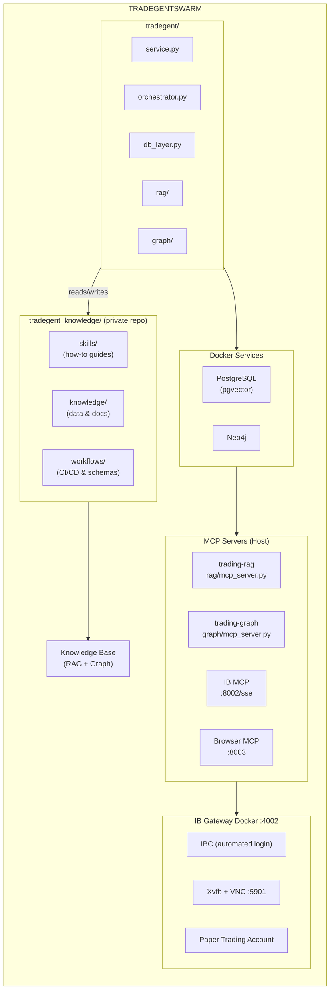

# TradegentSwarm

[](LICENSE)
[](https://github.com/vladm3105/TradegentSwarm/actions/workflows/ci.yml)
[](https://www.python.org/downloads/)

**Tradegent** — AI-driven trading platform that combines automated market analysis, trade execution, and a structured knowledge base. A multi-agent swarm powered by Claude Code CLI, Interactive Brokers for market data/execution, and a hybrid RAG+Graph system for knowledge persistence.

## Architecture



## Repository Structure

```
TradegentSwarm/
├── tradegent/                      # Tradegent Platform
│   ├── service.py                  # Long-running daemon (tick loop)
│   ├── orchestrator.py             # Pipeline engine + CLI
│   ├── db_layer.py                 # PostgreSQL access layer
│   ├── db/init.sql                 # Schema, seed data, views
│   ├── docker-compose.yml          # PG, IB Gateway, Neo4j
│   ├── rag/                        # RAG module (pgvector embeddings)
│   │   ├── mcp_server.py           # MCP server (primary interface)
│   │   ├── embed.py                # Document embedding
│   │   ├── search.py               # Semantic search
│   │   └── README.md               # RAG documentation
│   ├── graph/                      # Graph module (Neo4j)
│   │   ├── mcp_server.py           # MCP server (primary interface)
│   │   ├── layer.py                # Neo4j operations
│   │   ├── extract.py              # Entity extraction
│   │   └── README.md               # Graph documentation
│   ├── setup.sh                    # One-command setup
│   └── README.md                   # Platform documentation
│
├── tradegent_knowledge/            # Trading Knowledge System (private repo)
│   ├── knowledge/                  # Actual trading data & analyses
│   │   ├── analysis/               # Earnings, stock, research, profiles
│   │   ├── trades/                 # Executed trade journals
│   │   ├── strategies/             # Strategy definitions
│   │   ├── scanners/               # Scanner configs (daily/intraday/weekly)
│   │   ├── learnings/              # Biases, patterns, rules
│   │   ├── watchlist/              # Pending trade triggers
│   │   └── reviews/                # Post-trade reviews
│   │
│   ├── skills/                     # Agent-agnostic skill definitions
│   │   ├── earnings-analysis/      # 14-phase earnings framework (v2.5)
│   │   ├── stock-analysis/         # 13-phase stock framework (v2.5)
│   │   ├── research-analysis/      # 8-phase research framework (v2.1)
│   │   ├── trade-journal/          # 7-step trade documentation (v2.1)
│   │   ├── post-trade-review/      # 10-step learning loop (v2.1)
│   │   ├── watchlist/              # 8-step trigger monitoring (v2.1)
│   │   ├── ticker-profile/         # 10-phase ticker knowledge (v2.1)
│   │   └── market-scanning/        # Scanner execution (v1.0)
│   │
│   └── workflows/                  # CI/CD & validation
│       ├── .github/                # Actions workflows & scripts
│       └── .lightrag/              # Schemas & sync config
│
├── docs/                           # Platform documentation
│   ├── RISK_MANAGEMENT.md          # Position sizing, stops, gates
│   ├── RUNBOOKS.md                 # Operational procedures
│   └── SCANNER_ARCHITECTURE.md     # Scanner system design
│
└── scripts/                        # Utility scripts
    └── index_knowledge_base.py     # Bulk index to RAG + Graph
```

## Components

### Tradegent (`tradegent/`)

The Tradegent Platform — a database-driven orchestrator that runs analysis and execution pipelines via Claude Code CLI.

- **Two-stage pipeline**: Analysis (multi-source) → Gate check (EV, confidence, R:R) → Execution (paper trading)
- **Infrastructure**: PostgreSQL (pgvector) + IB Gateway + Neo4j via Docker Compose
- **Knowledge Base**: RAG (semantic search) + Graph (entity relationships) via MCP servers
- **Config in DB**: All settings live in PostgreSQL — no restarts to change behavior

See [tradegent/README.md](tradegent/README.md) for full setup and usage.

### IB Gateway Docker (`/opt/data/trading/ib-gateway-docker`)

Custom IB Gateway container with automated login via IBC (IB Controller). Uses socat proxy to accept external connections.

| Setting | Value |
|---------|-------|
| **Container** | `ib-gateway` |
| **Image** | `ib-gateway-docker-ib-gateway` |
| **API Port** | `4002` (external) → `4010` (internal via socat) |
| **VNC Port** | `5901` (for GUI troubleshooting) |
| **Trading Mode** | `paper` |
| **Account** | Your paper account (DU_XXXXXX) |

```bash
cd /opt/data/trading/ib-gateway-docker

# Configure credentials
cp .env.example .env
# Edit .env with IB_USER and IB_PASSWORD

# Build and start
docker compose up -d

# Check status
docker compose ps
docker compose logs -f
```

**Architecture:**

```
External Client → 0.0.0.0:4002 (socat) → 127.0.0.1:4010 (IB Gateway)
                                         ↑
                                  TrustedIPs=127.0.0.1
```

The socat proxy makes external connections appear as localhost, bypassing IB Gateway's TrustedIPs restriction.

**VNC Access:**

```bash
# Connect for GUI troubleshooting (no password)
open vnc://localhost:5901  # macOS
vncviewer localhost:5901   # Linux
```

**Source:** [/opt/data/trading/ib-gateway-docker](/opt/data/trading/ib-gateway-docker)

### MCP Servers

Two external MCP servers provide tool capabilities to the orchestrator and Claude Code.

#### IB MCP Server (`/opt/data/trading/mcp_ib`)

Interactive Brokers MCP server — exposes IB Gateway market data and trading operations as MCP tools via SSE transport.

| Setting | Value |
|---------|-------|
| **Container** | `ibmcp-test` |
| **Image** | `ibmcp:latest` |
| **Host Port** | `8002` (SSE endpoint: `http://localhost:8002/sse`) |
| **IB Gateway** | `ib-gateway:4002` (custom IB Gateway container) |
| **Client ID** | `2` (avoids conflict with orchestrator) |
| **Read-Only** | `true` |
| **Connect on Start** | `true` |

```bash
# Start (connected to ib-gateway-docker network)
docker run -d --name ibmcp-test \
  --network ib-gateway-docker_default \
  -e IB_GATEWAY_HOST=ib-gateway -e IB_GATEWAY_PORT=4002 \
  -e IB_CLIENT_ID=2 -e IB_READONLY=true -e IB_CONNECT_ON_START=true \
  -e PORT=8000 -p 8002:8000 ibmcp:latest
```

**Source:** [/opt/data/trading/mcp_ib](/opt/data/trading/mcp_ib)

##### IB MCP Usage

**Test connection:**

```bash
# Get AAPL quote via MCP protocol
python3 << 'EOF'
import requests, json, threading, time, queue

result_queue = queue.Queue()
session_ready = threading.Event()
session_url = [None]

def sse_listener():
    resp = requests.get('http://localhost:8002/sse', stream=True, timeout=60)
    for line in resp.iter_lines():
        if line:
            decoded = line.decode('utf-8')
            if decoded.startswith('data: /messages/'):
                session_url[0] = 'http://localhost:8002' + decoded[6:]
                session_ready.set()
            elif decoded.startswith('data:') and '{' in decoded:
                try: result_queue.put(json.loads(decoded[5:]))
                except: pass

threading.Thread(target=sse_listener, daemon=True).start()
session_ready.wait(timeout=10)

# Initialize
requests.post(session_url[0], json={"jsonrpc": "2.0", "id": 1, "method": "initialize",
    "params": {"protocolVersion": "2024-11-05", "capabilities": {},
               "clientInfo": {"name": "test", "version": "1.0"}}})
time.sleep(1)

# Get stock price
requests.post(session_url[0], json={"jsonrpc": "2.0", "id": 2, "method": "tools/call",
    "params": {"name": "get_stock_price", "arguments": {"symbol": "AAPL"}}})
time.sleep(10)

while not result_queue.empty():
    r = result_queue.get()
    if r.get('id') == 2:
        print(json.dumps(r.get('result', {}).get('structuredContent', {}), indent=2))
EOF
```

**Available tools:** `get_stock_price`, `get_option_chain`, `get_positions`, `health_check`, `get_historical_data`, `get_account_summary`, `place_order`, `cancel_order`, `get_open_orders`, `get_pnl`, `search_symbols`, `get_contract_details`, `run_scanner`, and more.

#### Browser MCP Server (`/opt/data/trading/mcp_brave-browser`)

Headless Chromium browser automation server — fetches and extracts web articles with caching and SSRF protection. Used for web research during analysis.

| Setting | Value |
|---------|-------|
| **Container** | `browser-mcp` |
| **Image** | `trading-browser-mcp:latest` |
| **Host Port** | `8003` (HTTP API: `http://localhost:8003`) |
| **Mode** | HTTP |
| **Headless** | `true` |
| **Page Timeout** | `30000ms` |
| **Cache TTL** | `3600s` (1 hour) |
| **Profile** | Persistent at `/opt/data/trading/mcp_brave-browser/brave-profile-browser-mcp/data/profile` |

```bash
# Start
docker run -d --name browser-mcp \
  -e MODE=http -e HOST=0.0.0.0 -e PORT=8080 \
  -e HEADLESS=true -e PAGE_TIMEOUT=30000 -e CACHE_TTL=3600 \
  -p 8003:8080 \
  -v /opt/data/trading/mcp_brave-browser/brave-profile-browser-mcp/data/profile:/app/profile \
  trading-browser-mcp:latest
```

**Source:** [/opt/data/trading/mcp_brave-browser](/opt/data/trading/mcp_brave-browser)

##### Browser MCP Usage

**Health Check:**

```bash
LD_LIBRARY_PATH= /usr/bin/curl -s http://localhost:8003/health
# {"status":"healthy","browser_connected":true,"cache_size":0}
```

**Fetch Article Content:**

```bash
LD_LIBRARY_PATH= /usr/bin/curl -s -X POST http://localhost:8003/api/fetch_article \
  -H "Content-Type: application/json" \
  -d '{"url":"https://www.google.com/finance/quote/NVDA:NASDAQ"}'
```

**Take Screenshot:**

```bash
LD_LIBRARY_PATH= /usr/bin/curl -s -X POST http://localhost:8003/api/screenshot \
  -H "Content-Type: application/json" \
  -d '{"url":"https://finviz.com/chart.ashx?t=NVDA","full_page":false}'
```

**Extract Structured Data:**

```bash
LD_LIBRARY_PATH= /usr/bin/curl -s -X POST http://localhost:8003/api/extract_data \
  -H "Content-Type: application/json" \
  -d '{
    "url":"https://seekingalpha.com/symbol/NVDA",
    "selectors":{"price":"[data-test-id=price]","eps":"[data-test-id=eps]"}
  }'
```

**Python Example:**

```python
import requests

BROWSER_API = "http://localhost:8003/api"

# Fetch article
response = requests.post(f"{BROWSER_API}/fetch_article",
    json={"url": "https://www.google.com/finance/quote/NVDA:NASDAQ"})
content = response.json()["content"]

# Take screenshot (returns base64 PNG)
response = requests.post(f"{BROWSER_API}/screenshot",
    json={"url": "https://finviz.com/chart.ashx?t=NVDA", "full_page": True})
screenshot_b64 = response.json()["screenshot"]
```

**Endpoints:**

| Endpoint | Method | Purpose |
| -------- | ------ | ------- |
| `/health` | GET | Check browser connection status |
| `/api/fetch_article` | POST | Extract article text content |
| `/api/screenshot` | POST | Capture page screenshot (base64) |
| `/api/extract_data` | POST | Extract data via CSS selectors |
| `/api/search` | POST | Search and extract results |
| `/api/cache/clear` | POST | Clear article cache |

**Note:** Use `LD_LIBRARY_PATH= /usr/bin/curl` to avoid Anaconda libcurl conflict.

### Trading Knowledge (`tradegent_knowledge/knowledge/`)

Structured YAML repository of trading data: analyses, trade journals, strategies, scanner configs, and learnings. All files follow the `{TICKER}_{YYYYMMDDTHHMM}.yaml` naming convention.

**Three-Layer Data Model:**
- **Layer 1: Files** - Source of truth (YAML documents in `knowledge/`)
- **Layer 2: RAG** - Semantic search (PostgreSQL with pgvector)
- **Layer 3: Graph** - Entity relationships (Neo4j)

Files are authoritative. If RAG/Graph conflict with files, files win. Both RAG and Graph can be rebuilt from files.

See [tradegent_knowledge/knowledge/README.md](tradegent_knowledge/knowledge/README.md) for details.

### Scanner System (`tradegent_knowledge/knowledge/scanners/`)

YAML-based scanner configurations that encode systematic opportunity-finding rules. Scanners combine IB market data with web search, apply quality filters, score candidates, and route to analysis skills.

| Type | Folder | Examples |
|------|--------|----------|
| Daily | `scanners/daily/` | premarket-gap, earnings-momentum, 52w-extremes |
| Intraday | `scanners/intraday/` | options-flow, unusual-volume |
| Weekly | `scanners/weekly/` | earnings-calendar, institutional-activity |

**Score Routing:**
- ≥ 7.5: Trigger full analysis skill
- 5.5-7.4: Add to watchlist
- < 5.5: Skip

See [docs/SCANNER_ARCHITECTURE.md](docs/SCANNER_ARCHITECTURE.md) for full architecture.

### Trading Skills (`tradegent_knowledge/skills/`)

Agent-agnostic skill definitions with step-by-step frameworks and YAML templates. Works with any LLM — each skill is self-contained and single-purpose.

**v2.5 Features (stock-analysis, earnings-analysis):**
- Steel-man bear case with scored arguments
- Bias countermeasures (rule + implementation + checklist + mantra)
- Pre-exit gate for loss aversion prevention
- Do Nothing gate (EV >5%, Confidence >60%, R:R >2:1, Edge exists)
- 4-scenario framework (bull, base, bear, disaster)
- Post-save indexing to RAG + Graph

See [tradegent_knowledge/skills/README.md](tradegent_knowledge/skills/README.md) for the full skill index.

### Trading Workflows (`tradegent_knowledge/workflows/`)

GitHub Actions CI/CD for validating documents against JSON schemas. Includes schemas for all document types.

### Private Repository Note

The `tradegent_knowledge/` directory is cloned from a separate private repository (`vladm3105/tradegent-knowledge`) to keep trading data, scanner configs, and analyses confidential. This public repository contains only the platform code.

## Security

The platform includes comprehensive security measures to prevent credential exposure.

### Secret Scanning

| Layer | Tool | Purpose |
|-------|------|---------|
| Local | pre-commit hooks | Blocks commits with secrets |
| CI/CD | Gitleaks + TruffleHog | Scans all PRs and pushes |
| CI/CD | Custom patterns | Trading-specific credential detection |

**Detected patterns:** OpenAI/Anthropic/OpenRouter API keys, PostgreSQL connection strings, IB credentials, Neo4j passwords, VNC passwords.

### Setup Pre-commit Hooks

```bash
pip install pre-commit
pre-commit install
```

This runs secret scanning before every commit locally.

### Audit Logging

All significant actions are logged to `nexus.audit_log` for security tracking and compliance.

## CI/CD

GitHub Actions workflows run on every push and PR:

| Workflow | Purpose |
|----------|---------|
| `secrets-scan.yml` | Blocks any commit with exposed secrets |
| `ci.yml` | Lint, test, security scan |

The secrets scan runs **first** and blocks all other jobs if secrets are detected.

## Prerequisites

| Requirement | Purpose |
|-------------|---------|
| Docker + Compose | Infrastructure services |
| Python 3.11+ | Orchestrator runtime |
| Node.js 20+ | Claude Code CLI dependency |
| Claude Code CLI | AI engine |
| Anthropic API key | Automated analysis |
| OpenAI API key | Embeddings + extraction (~$2/year) |
| IB paper account | Market data & execution |
### Port Map

| Service | Host Port | Container | Notes |
|---------|-----------|-----------|-------|
| PostgreSQL | 5433 | nexus-postgres | Remapped from 5432 (RAC uses 5432) |
| Neo4j HTTP | 7475 | nexus-neo4j | Remapped from 7474 |
| Neo4j Bolt | 7688 | nexus-neo4j | Remapped from 7687 |
| IB Gateway (API) | 4002 | ib-gateway | External API (socat → 4010 internal) |
| IB Gateway (VNC) | 5901 | ib-gateway | VNC for GUI troubleshooting |
| IB MCP | 8002 | ibmcp-test | SSE at `/sse` |
| Browser MCP | 8003 | browser-mcp | HTTP API |
| Ollama | 11434 | (host) | Optional: local LLM fallback |
## Quick Start

```bash
cd tradegent
cp .env.template .env        # Fill in credentials
./setup.sh                   # Start infrastructure
python service.py            # Run the daemon
```

See [tradegent/README.md](tradegent/README.md) for detailed instructions.

## Development

### Setup

```bash
# Clone
git clone git@github.com:vladm3105/TradegentSwarm.git
cd TradegentSwarm

# Install dependencies
pip install -e ".[dev]"

# Setup pre-commit hooks (required)
pip install pre-commit
pre-commit install
```

### Testing

```bash
cd tradegent

# Run all tests
pytest

# Run with coverage
pytest --cov=rag --cov=graph --cov-report=html

# Run specific modules
pytest tests/                    # Orchestrator + DB layer tests
pytest rag/tests/                # RAG tests
pytest graph/tests/              # Graph tests
```

### Commit Guidelines

- Pre-commit hooks run automatically (secret scanning, linting)
- CI/CD runs on all PRs and pushes
- Secrets in commits will be blocked

## Contributing

Contributions are welcome. See [CONTRIBUTING.md](CONTRIBUTING.md) for guidelines on:

- Development environment setup
- Code style and linting
- Testing requirements
- Pull request process

## License

This project is licensed under the MIT License - see [LICENSE](LICENSE) for details.
