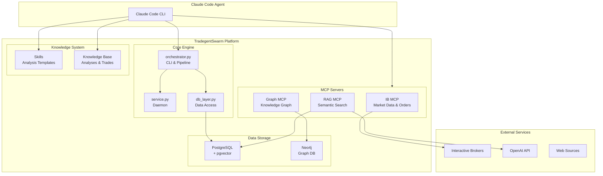
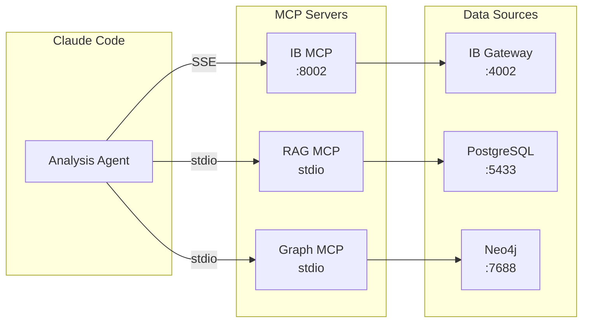
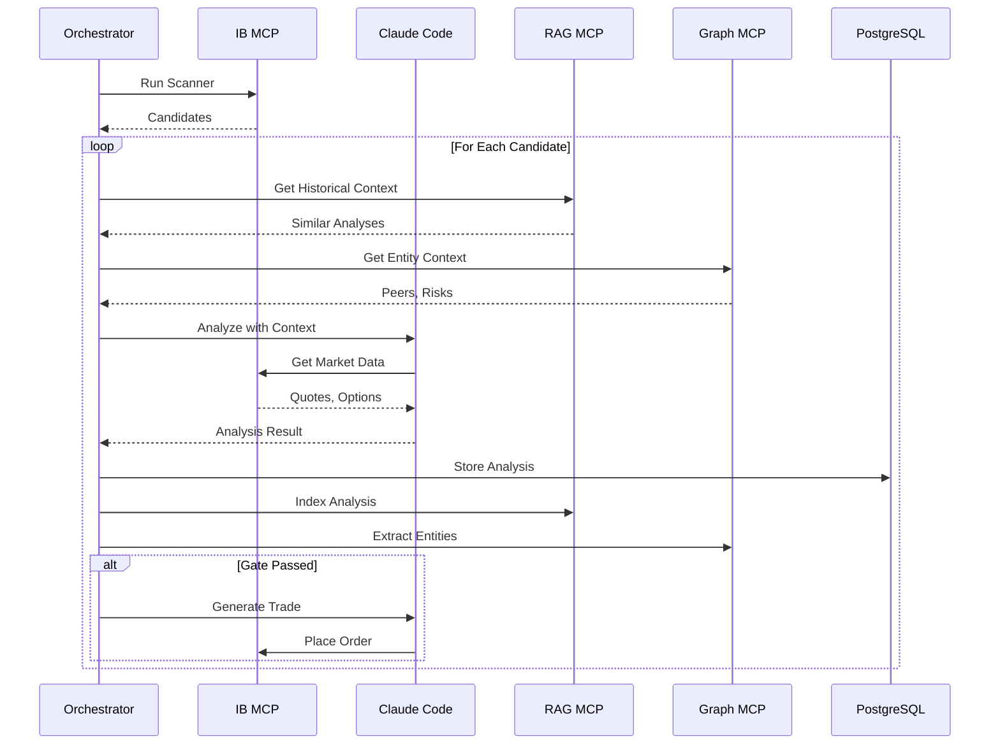
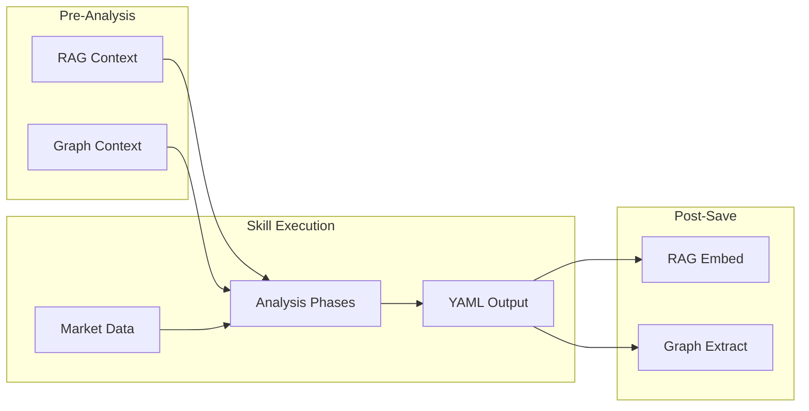

# TradegentSwarm Architecture

> **Last Updated**: 2026-02-21
> **Skills Version**: v2.3 (stock-analysis, earnings-analysis), v2.1 (other skills)

## System Overview

TradegentSwarm is an AI-driven trading platform that combines automated market analysis, trade execution, and knowledge persistence.

## Core Components

### Orchestrator (`tradegent/orchestrator.py`)

Central CLI and pipeline engine:

- **Scanner Pipeline**: Run IB market scanners, score candidates
- **Analysis Pipeline**: Generate AI analyses via Claude Code
- **Execution Pipeline**: Execute trades via IB (paper/live)
- **Watchlist Management**: Track stocks through analysis states

### Service Daemon (`tradegent/service.py`)

Long-running background service:

- Scheduled task execution
- Health monitoring endpoint
- Automatic analysis triggers

### Database Layer (`tradegent/db_layer.py`)

PostgreSQL access with connection pooling:

- Stock watchlist management
- Scanner configuration
- Run history and audit logging
- Analysis results storage

## MCP Server Architecture

### IB MCP Server

Market data and trading via Interactive Brokers:

- Real-time quotes and historical data
- Option chains and Greeks
- Order placement and management
- Market scanners

**Documentation**: External repository

### RAG MCP Server (`tradegent/rag/`)

Semantic search and document embedding:

- OpenAI embeddings (text-embedding-3-large)
- Hybrid search (vector + BM25)
- Document chunking and indexing

**Documentation**: [TRADING_RAG_ARCHITECTURE.md](TRADING_RAG_ARCHITECTURE.md)

### Graph MCP Server (`tradegent/graph/`)

Knowledge graph for entity relationships:

- Entity extraction from analyses
- Sector/peer relationships
- Risk and bias tracking

**Documentation**: [TRADING_GRAPH_ARCHITECTURE.md](TRADING_GRAPH_ARCHITECTURE.md)

## Data Flow

### Scanner → Analysis → Execution Pipeline

### Knowledge Persistence

Every analysis is:

1. **Stored** in PostgreSQL (`analysis_results` table)
2. **Embedded** in RAG for semantic search
3. **Extracted** to Graph for entity relationships

This enables:

- Historical context injection in new analyses
- Pattern recognition across trades
- Bias and risk tracking over time

## Infrastructure

### Docker Services

| Service | Image | Port | Purpose |
|---------|-------|------|---------|
| PostgreSQL | postgres:17 + pgvector | 5433 | Primary database |
| Neo4j | neo4j:5 | 7688 | Knowledge graph |
| IB Gateway | custom | 4002, 5901 | Trading API |

### Configuration

Environment variables in `.env`:

| Category | Variables |
|----------|-----------|
| Database | `PG_USER`, `PG_PASS`, `PG_DB`, `PG_HOST`, `PG_PORT` |
| Neo4j | `NEO4J_URI`, `NEO4J_USER`, `NEO4J_PASS` |
| IB | `IB_USER`, `IB_PASS`, `IB_ACCOUNT` |
| LLM | `EMBED_PROVIDER`, `OPENAI_API_KEY` |

## Security

- **Secrets**: Never committed; `.env` files gitignored
- **Pre-commit**: Gitleaks scanning on every commit
- **CI/CD**: Blocking secrets scan before other jobs
- **Audit**: All operations logged to `audit_log` table

## Skills System

The skills system provides structured YAML templates for consistent AI analysis output.

### Skill Versions

| Skill | Version | Key Features |
|-------|---------|--------------|
| **stock-analysis** | v2.3 | 12-phase workflow, steel-man bear case, bias countermeasures, pre-exit gate, do-nothing gate, falsification criteria, 4-scenario framework, meta-learning |
| **earnings-analysis** | v2.3 | 14-phase workflow, historical moves, expectations assessment, bear case analysis, bias tracking |
| **research-analysis** | v2.1 | Counter-thesis (steel-manned), bias check, confidence tracking |
| **trade-journal** | v2.1 | Pre-trade checklist, psychological state, decision quality, loss aversion check |
| **post-trade-review** | v2.1 | Data source effectiveness, countermeasures, rule validation, comparison to similar trades |
| **ticker-profile** | v2.1 | Analysis track record, bias history, learned patterns, known risks |
| **watchlist** | v2.1 | Conviction levels, thesis reasoning, analysis quality check |

### v2.3 Key Enhancements

**Reasoning Sections** (using YAML multi-line `|` blocks):
- Steel-man bear case with scored arguments
- Bias countermeasure structure: rule + implementation + checklist + mantra
- Pre-exit gate for loss aversion prevention
- Do Nothing gate with 4 criteria (EV >5%, Confidence >60%, R:R >2:1, Edge exists)

**Meta-Learning**:
- Pattern application tracking with outcomes
- Rule validation status (Pending/Validated/Rejected)
- New learning creation with validation criteria

**Integration**:
- `_indexing` hints in templates for RAG/Graph processing
- Field mappings in `tradegent/graph/field_mappings.yaml`
- Migration script: `scripts/migrate_skills_v23.py`

### Skill Workflow Pattern

## Related Documentation

- [Scanner Architecture](SCANNER_ARCHITECTURE.md)
- [RAG Architecture](TRADING_RAG_ARCHITECTURE.md)
- [Graph Architecture](TRADING_GRAPH_ARCHITECTURE.md)
- [Skills Enhancement Plan](../tmp/SKILLS_ENHANCEMENT_PLAN_v2.md)
