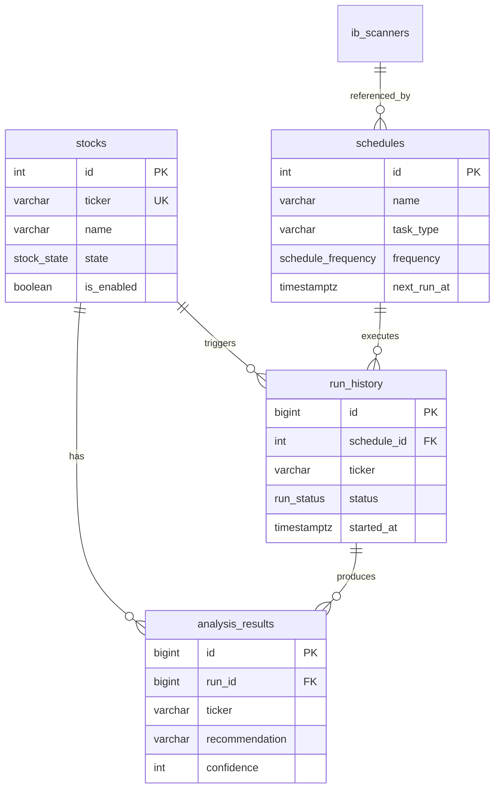

# Database Schema Reference

TradegentSwarm uses PostgreSQL with the `nexus` schema for all platform data. This document provides a complete reference for the database structure.

## Schema Overview

```
nexus schema
├── stocks              # Watchlist and stock metadata
├── ib_scanners         # IB market scanner configurations
├── schedules           # Automated task schedules
├── run_history         # Execution audit log
├── analysis_results    # Structured analysis outputs
├── settings            # Hot-reloadable key-value settings
├── service_status      # Service health and metrics
└── audit_log           # Security audit trail
```

## Entity Relationship Diagram



---

## Enum Types

### stock_state
Stock lifecycle state machine.

| Value | Description |
|-------|-------------|
| `analysis` | Observe only, no trading |
| `paper` | Paper trading enabled |
| `live` | Live trading (blocked in code) |

### analysis_type
Type of analysis to perform.

| Value | Description |
|-------|-------------|
| `earnings` | Pre-earnings analysis |
| `stock` | General stock analysis |
| `scan` | Scanner result analysis |
| `review` | Portfolio review |
| `postmortem` | Post-earnings review |

### schedule_frequency
How often a schedule runs.

| Value | Description |
|-------|-------------|
| `once` | Run once then disable |
| `daily` | Every trading day |
| `weekly` | Once per week |
| `pre_earnings` | N days before earnings |
| `post_earnings` | N days after earnings |
| `interval` | Every N minutes |

### run_status
Execution status tracking.

| Value | Description |
|-------|-------------|
| `pending` | Queued for execution |
| `running` | Currently executing |
| `completed` | Finished successfully |
| `failed` | Finished with error |
| `skipped` | Skipped (circuit breaker, limits) |

### day_of_week
Day enumeration for weekly schedules.

| Value | Description |
|-------|-------------|
| `mon` | Monday |
| `tue` | Tuesday |
| `wed` | Wednesday |
| `thu` | Thursday |
| `fri` | Friday |
| `sat` | Saturday |
| `sun` | Sunday |

---

## Tables

### nexus.stocks

**Purpose:** Watchlist of stocks to monitor and trade.

| Column | Type | Nullable | Default | Description |
|--------|------|----------|---------|-------------|
| `id` | SERIAL | NO | auto | Primary key |
| `ticker` | VARCHAR(10) | NO | — | Stock symbol (unique) |
| `name` | VARCHAR(100) | YES | — | Company name |
| `sector` | VARCHAR(50) | YES | — | Industry sector |
| `is_enabled` | BOOLEAN | NO | true | Include in batch runs |
| `state` | stock_state | NO | 'analysis' | Trading state |
| `default_analysis_type` | analysis_type | NO | 'stock' | Default analysis |
| `priority` | INTEGER | NO | 5 | Processing order (1-10) |
| `next_earnings_date` | DATE | YES | — | Upcoming earnings |
| `earnings_confirmed` | BOOLEAN | YES | false | Date confirmed |
| `beat_history` | VARCHAR(20) | YES | — | e.g., "11/12" |
| `has_open_position` | BOOLEAN | YES | false | Position held |
| `position_state` | VARCHAR(20) | YES | — | 'none', 'pending', 'filled' |
| `max_position_pct` | NUMERIC(5,2) | YES | 6.0 | Max position % of portfolio |
| `comments` | TEXT | YES | — | Notes |
| `tags` | TEXT[] | YES | — | Filterable tags |
| `created_at` | TIMESTAMPTZ | NO | now() | Record created |
| `updated_at` | TIMESTAMPTZ | NO | now() | Last modified |

**Indexes:**
- `idx_stocks_enabled` - Partial on `is_enabled = true`
- `idx_stocks_state` - On `state`
- `idx_stocks_earnings` - Partial on `next_earnings_date IS NOT NULL`
- `idx_stocks_tags` - GIN on `tags`

**Example Query:**
```sql
-- Get all enabled stocks with upcoming earnings
SELECT ticker, name, next_earnings_date,
       next_earnings_date - CURRENT_DATE AS days_until
FROM nexus.stocks
WHERE is_enabled = true
  AND next_earnings_date >= CURRENT_DATE
ORDER BY next_earnings_date;
```

---

### nexus.ib_scanners

**Purpose:** IB market scanner configurations for opportunity discovery.

| Column | Type | Nullable | Default | Description |
|--------|------|----------|---------|-------------|
| `id` | SERIAL | NO | auto | Primary key |
| `scanner_code` | VARCHAR(100) | NO | — | IB scanner code (unique) |
| `display_name` | VARCHAR(200) | NO | — | Human-readable name |
| `description` | TEXT | YES | — | Scanner description |
| `is_enabled` | BOOLEAN | NO | true | Scanner active |
| `instrument` | VARCHAR(20) | YES | 'STK' | STK, OPT, FUT |
| `location` | VARCHAR(50) | YES | 'STK.US.MAJOR' | Market location |
| `num_results` | INTEGER | YES | 20 | Max results (1-50) |
| `filters` | JSONB | YES | '{}' | IB filter parameters |
| `auto_add_to_watchlist` | BOOLEAN | YES | false | Add results to watchlist |
| `auto_analyze` | BOOLEAN | YES | false | Trigger analysis |
| `analysis_type` | analysis_type | YES | 'stock' | Type if auto_analyze |
| `max_candidates` | INTEGER | YES | 5 | Top N to analyze |
| `comments` | TEXT | YES | — | Notes |
| `created_at` | TIMESTAMPTZ | NO | now() | Record created |
| `updated_at` | TIMESTAMPTZ | NO | now() | Last modified |

**Common Scanner Codes:**
- `TOP_PERC_GAIN` - Top percentage gainers
- `TOP_PERC_LOSE` - Top percentage losers
- `HIGH_OPT_IMP_VOLAT` - High implied volatility
- `HOT_BY_OPT_VOLUME` - Hot by options volume
- `MOST_ACTIVE` - Most active by volume

**Filters JSONB Structure:**
```json
{
  "priceAbove": 10,
  "priceBelow": 500,
  "marketCapAbove": 1000000000,
  "volumeAbove": 500000,
  "avgOptVolumeAbove": 1000
}
```

---

### nexus.schedules

**Purpose:** Automated task scheduling (cron-like).

| Column | Type | Nullable | Default | Description |
|--------|------|----------|---------|-------------|
| `id` | SERIAL | NO | auto | Primary key |
| `name` | VARCHAR(200) | NO | — | Schedule name |
| `description` | TEXT | YES | — | Description |
| `is_enabled` | BOOLEAN | NO | true | Schedule active |
| `task_type` | VARCHAR(50) | NO | — | Task to run |
| `target_ticker` | VARCHAR(10) | YES | — | Stock target |
| `target_scanner_id` | INTEGER | YES | — | Scanner FK |
| `target_tags` | TEXT[] | YES | — | Tag filter |
| `analysis_type` | analysis_type | YES | 'stock' | Analysis type |
| `auto_execute` | BOOLEAN | YES | false | Enable Stage 2 |
| `custom_prompt` | TEXT | YES | — | For task_type='custom' |
| `frequency` | schedule_frequency | NO | 'daily' | Run frequency |
| `time_of_day` | TIME | YES | — | Run time (ET) |
| `day_of_week` | day_of_week | YES | — | For weekly |
| `interval_minutes` | INTEGER | YES | — | For 'interval' |
| `days_before_earnings` | INTEGER | YES | — | For 'pre_earnings' |
| `days_after_earnings` | INTEGER | YES | — | For 'post_earnings' |
| `market_hours_only` | BOOLEAN | YES | true | Restrict to market hours |
| `trading_days_only` | BOOLEAN | YES | true | Skip weekends |
| `max_runs_per_day` | INTEGER | YES | 1 | Daily limit |
| `timeout_seconds` | INTEGER | YES | 600 | Task timeout |
| `priority` | INTEGER | YES | 5 | Execution order |
| `last_run_at` | TIMESTAMPTZ | YES | — | Last execution |
| `last_run_status` | run_status | YES | — | Last result |
| `next_run_at` | TIMESTAMPTZ | YES | — | Next scheduled |
| `run_count` | INTEGER | YES | 0 | Total runs |
| `fail_count` | INTEGER | YES | 0 | Total failures |
| `consecutive_fails` | INTEGER | YES | 0 | Current fail streak |
| `max_consecutive_fails` | INTEGER | YES | 3 | Circuit breaker limit |
| `comments` | TEXT | YES | — | Notes |
| `created_at` | TIMESTAMPTZ | NO | now() | Record created |
| `updated_at` | TIMESTAMPTZ | NO | now() | Last modified |

**Task Types:**
- `analyze_stock` - Single stock analysis
- `analyze_watchlist` - All enabled stocks
- `run_scanner` - Execute one scanner
- `run_all_scanners` - Execute all scanners
- `pipeline` - Analysis + execution
- `portfolio_review` - Portfolio review
- `postmortem` - Post-earnings review
- `custom` - Custom Claude prompt

---

### nexus.run_history

**Purpose:** Audit log of all orchestrator executions.

| Column | Type | Nullable | Default | Description |
|--------|------|----------|---------|-------------|
| `id` | BIGSERIAL | NO | auto | Primary key |
| `schedule_id` | INTEGER | YES | — | Schedule FK |
| `task_type` | VARCHAR(50) | NO | — | Task executed |
| `ticker` | VARCHAR(10) | YES | — | Stock symbol |
| `analysis_type` | analysis_type | YES | — | Analysis type |
| `status` | run_status | NO | 'pending' | Current status |
| `stage` | VARCHAR(20) | YES | — | 'analysis', 'execution' |
| `gate_passed` | BOOLEAN | YES | — | Do Nothing gate |
| `recommendation` | VARCHAR(20) | YES | — | BUY/SELL/HOLD |
| `confidence` | INTEGER | YES | — | 0-100 |
| `expected_value` | NUMERIC(6,2) | YES | — | Expected return % |
| `order_placed` | BOOLEAN | YES | — | Order submitted |
| `order_id` | VARCHAR(50) | YES | — | IB order ID |
| `order_details` | JSONB | YES | — | Order specifics |
| `analysis_file` | VARCHAR(500) | YES | — | Output file path |
| `trade_file` | VARCHAR(500) | YES | — | Trade log path |
| `started_at` | TIMESTAMPTZ | NO | now() | Start time |
| `completed_at` | TIMESTAMPTZ | YES | — | End time |
| `duration_seconds` | NUMERIC(8,2) | YES | — | Execution time |
| `error_message` | TEXT | YES | — | Error details |
| `raw_output` | TEXT | YES | — | Full output |

---

### nexus.analysis_results

**Purpose:** Structured analysis outputs parsed from Claude responses.

| Column | Type | Nullable | Default | Description |
|--------|------|----------|---------|-------------|
| `id` | BIGSERIAL | NO | auto | Primary key |
| `run_id` | BIGINT | YES | — | Run history FK |
| `ticker` | VARCHAR(10) | NO | — | Stock symbol |
| `analysis_type` | analysis_type | NO | — | Analysis type |
| `gate_passed` | BOOLEAN | YES | — | Do Nothing gate |
| `recommendation` | VARCHAR(20) | YES | — | BUY/SELL/HOLD |
| `confidence` | INTEGER | YES | — | 0-100 |
| `expected_value_pct` | NUMERIC(6,2) | YES | — | Expected return |
| `entry_price` | NUMERIC(10,2) | YES | — | Entry target |
| `stop_loss` | NUMERIC(10,2) | YES | — | Stop loss price |
| `target_price` | NUMERIC(10,2) | YES | — | Target price |
| `position_size_pct` | NUMERIC(5,2) | YES | — | Position size % |
| `structure` | VARCHAR(30) | YES | — | Trade structure |
| `expiry_date` | DATE | YES | — | Option expiry |
| `strikes` | NUMERIC(10,2)[] | YES | — | Option strikes |
| `rationale` | TEXT | YES | — | Analysis summary |
| `price_at_analysis` | NUMERIC(10,2) | YES | — | Price snapshot |
| `iv_at_analysis` | NUMERIC(6,2) | YES | — | IV snapshot |
| `created_at` | TIMESTAMPTZ | NO | now() | Record created |

**Example Query:**
```sql
-- Get recent NVDA analyses with recommendations
SELECT created_at, recommendation, confidence, expected_value_pct
FROM nexus.analysis_results
WHERE ticker = 'NVDA'
ORDER BY created_at DESC
LIMIT 10;
```

---

### nexus.settings

**Purpose:** Hot-reloadable key-value configuration.

| Column | Type | Nullable | Default | Description |
|--------|------|----------|---------|-------------|
| `key` | VARCHAR(100) | NO | — | Setting name (PK) |
| `value` | JSONB | NO | — | Setting value |
| `description` | TEXT | YES | — | Setting description |
| `category` | VARCHAR(50) | NO | 'general' | Setting category |
| `updated_at` | TIMESTAMPTZ | NO | now() | Last modified |

**Categories:**
- `general` - Paths, general settings
- `rate_limits` - Daily/concurrent limits
- `claude` - Claude Code settings
- `ib` - Interactive Brokers settings
- `scheduler` - Scheduler timing
- `feature_flags` - Global toggles

**Key Settings:**
| Key | Default | Description |
|-----|---------|-------------|
| `dry_run_mode` | true | Block all Claude calls |
| `auto_execute_enabled` | false | Enable Stage 2 |
| `max_daily_analyses` | 15 | Daily analysis limit |
| `max_daily_executions` | 5 | Daily order limit |
| `claude_timeout_seconds` | 600 | Max Claude call time |

---

### nexus.service_status

**Purpose:** Singleton row tracking service health (heartbeat).

| Column | Type | Nullable | Default | Description |
|--------|------|----------|---------|-------------|
| `id` | INTEGER | NO | 1 | Always 1 (singleton) |
| `started_at` | TIMESTAMPTZ | NO | now() | Service start |
| `last_heartbeat` | TIMESTAMPTZ | NO | now() | Last ping |
| `last_tick_duration_ms` | INTEGER | YES | — | Last tick time |
| `state` | VARCHAR(20) | NO | 'starting' | Service state |
| `current_task` | VARCHAR(200) | YES | — | Current work |
| `pid` | INTEGER | YES | — | Process ID |
| `hostname` | VARCHAR(100) | YES | — | Host machine |
| `version` | VARCHAR(20) | YES | '2.1.0' | Software version |
| `ticks_total` | INTEGER | YES | 0 | Total ticks |
| `analyses_total` | INTEGER | YES | 0 | Total analyses |
| `executions_total` | INTEGER | YES | 0 | Total executions |
| `errors_total` | INTEGER | YES | 0 | Total errors |
| `today_analyses` | INTEGER | YES | 0 | Today's analyses |
| `today_executions` | INTEGER | YES | 0 | Today's executions |
| `today_errors` | INTEGER | YES | 0 | Today's errors |
| `today_date` | DATE | YES | CURRENT_DATE | Counter date |
| `updated_at` | TIMESTAMPTZ | NO | now() | Last update |

---

### nexus.audit_log

**Purpose:** Security audit trail for compliance.

| Column | Type | Nullable | Default | Description |
|--------|------|----------|---------|-------------|
| `id` | BIGSERIAL | NO | auto | Primary key |
| `timestamp` | TIMESTAMPTZ | NO | now() | Event time |
| `action` | VARCHAR(50) | NO | — | Action type |
| `actor` | VARCHAR(100) | NO | 'system' | Who did it |
| `resource_type` | VARCHAR(50) | YES | — | What type |
| `resource_id` | VARCHAR(100) | YES | — | What ID |
| `result` | VARCHAR(20) | NO | 'success' | Outcome |
| `details` | JSONB | YES | '{}' | Extra info |
| `ip_address` | INET | YES | — | Client IP |
| `user_agent` | VARCHAR(500) | YES | — | Client agent |
| `session_id` | VARCHAR(100) | YES | — | Session ID |

**Action Types:**
- `stock_add`, `stock_update`, `stock_delete`
- `setting_change`
- `schedule_create`, `schedule_delete`
- `order_placed`, `order_cancelled`
- `cypher_blocked`

---

## Views

### nexus.v_due_schedules

Schedules ready for execution.

```sql
SELECT * FROM nexus.v_due_schedules;
```

Returns enabled schedules where:
- `next_run_at <= now()`
- `consecutive_fails < max_consecutive_fails`

### nexus.v_upcoming_earnings

Stocks with earnings in next 21 days.

```sql
SELECT * FROM nexus.v_upcoming_earnings;
```

Returns:
- All enabled stocks with upcoming earnings
- Includes `days_until_earnings` calculated field

---

## Functions

### nexus.update_timestamp()

Trigger function to auto-update `updated_at` column.

### nexus.audit_log_event()

Helper to log audit events.

```sql
SELECT nexus.audit_log_event(
    'setting_change',      -- action
    'setting',             -- resource_type
    'dry_run_mode',        -- resource_id
    'success',             -- result
    '{"old": true, "new": false}'::jsonb,  -- details
    'cli:user'             -- actor
);
```

---

## Triggers

| Table | Trigger | Function | Timing |
|-------|---------|----------|--------|
| stocks | stocks_updated_at | update_timestamp() | BEFORE UPDATE |
| ib_scanners | scanners_updated_at | update_timestamp() | BEFORE UPDATE |
| schedules | schedules_updated_at | update_timestamp() | BEFORE UPDATE |
| settings | settings_updated_at | update_timestamp() | BEFORE UPDATE |

---

## Common Queries

### Get Service Status
```sql
SELECT state, last_heartbeat,
       today_analyses, today_executions,
       now() - last_heartbeat AS heartbeat_age
FROM nexus.service_status;
```

### Get Enabled Stocks by Priority
```sql
SELECT ticker, name, state, priority,
       next_earnings_date
FROM nexus.stocks
WHERE is_enabled = true
ORDER BY priority DESC, ticker;
```

### Get Recent Analysis Results
```sql
SELECT ticker, analysis_type, recommendation,
       confidence, created_at
FROM nexus.analysis_results
WHERE created_at >= CURRENT_DATE - INTERVAL '7 days'
ORDER BY created_at DESC;
```

### Get Failed Runs
```sql
SELECT id, ticker, task_type, error_message, started_at
FROM nexus.run_history
WHERE status = 'failed'
ORDER BY started_at DESC
LIMIT 20;
```

### Update Setting
```sql
UPDATE nexus.settings
SET value = 'false'::jsonb
WHERE key = 'dry_run_mode';
```

---

## Schema Initialization

To initialize or reset the schema:

```bash
# Initialize (first time)
python orchestrator.py db-init

# Or manually
psql -h localhost -p 5433 -U lightrag -d lightrag -f tradegent/db/init.sql
```

The `init.sql` script is idempotent - safe to run multiple times.
