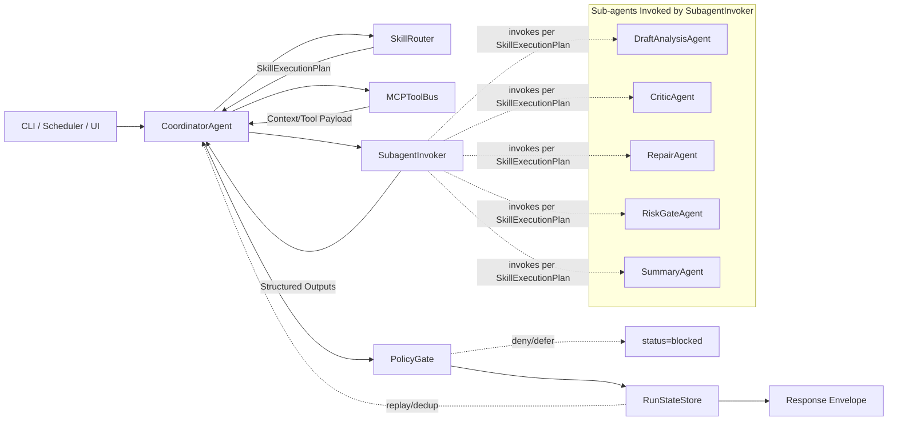
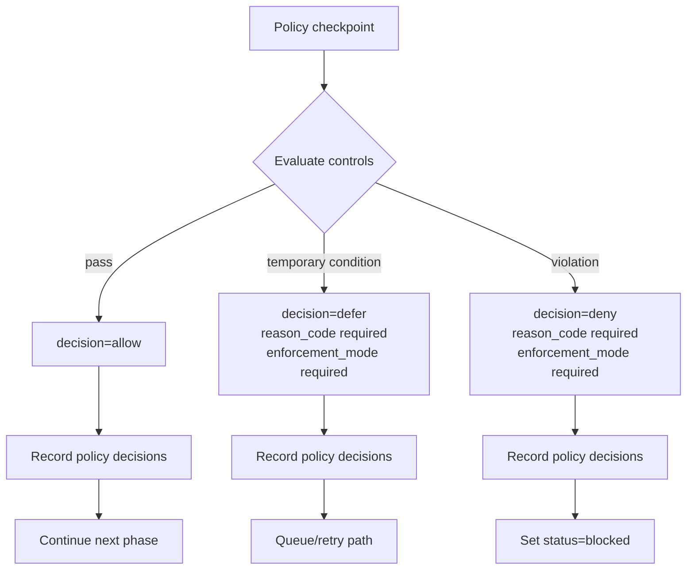
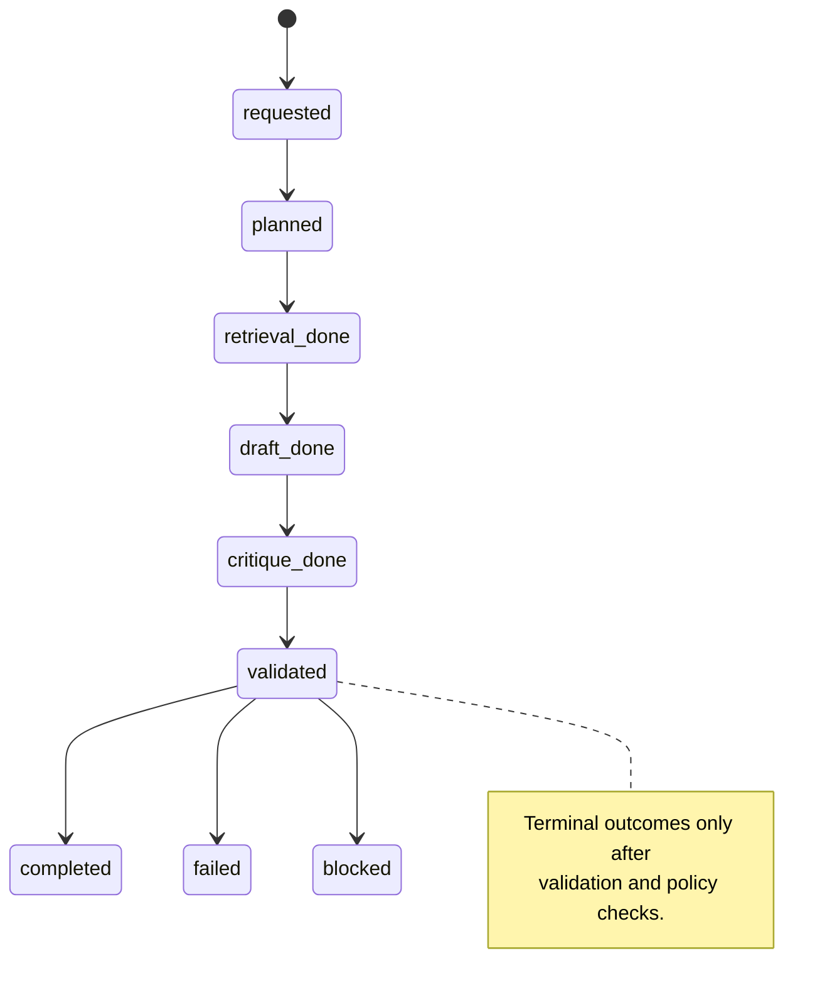
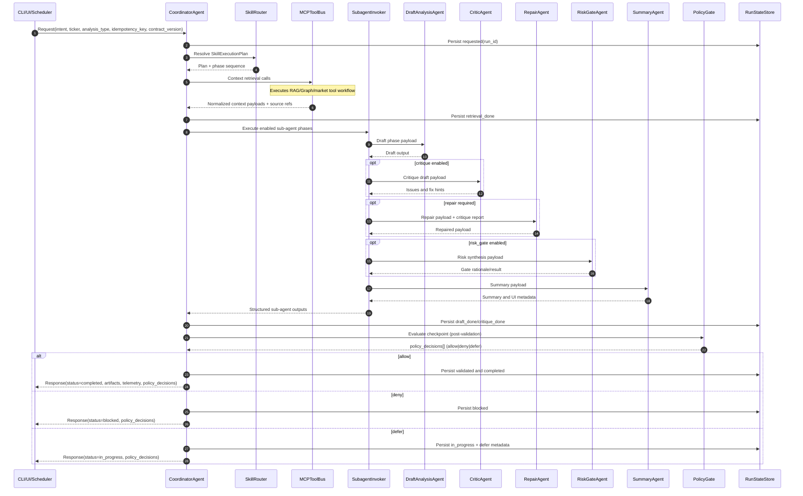
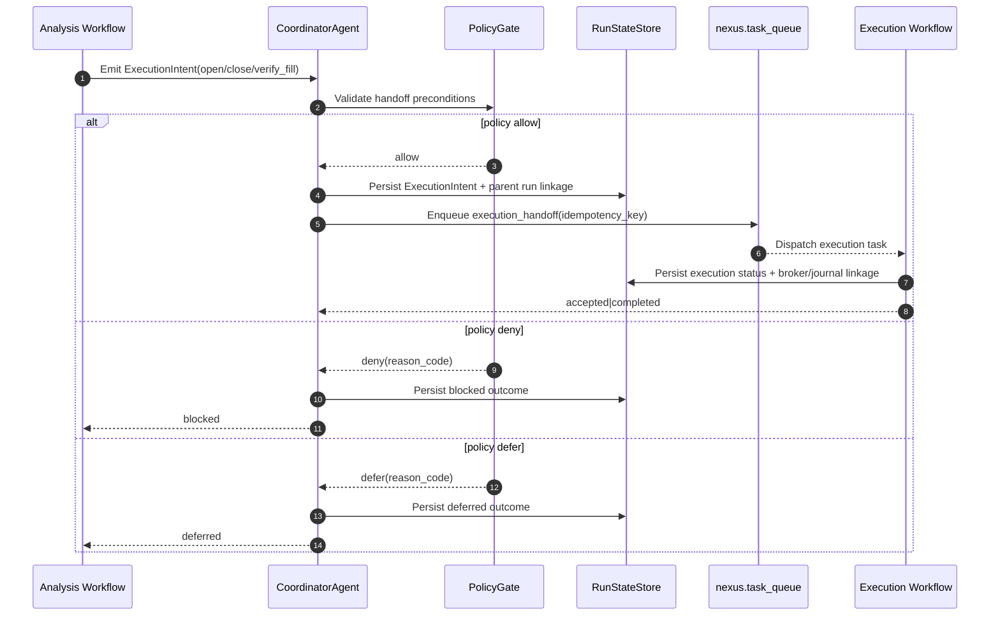
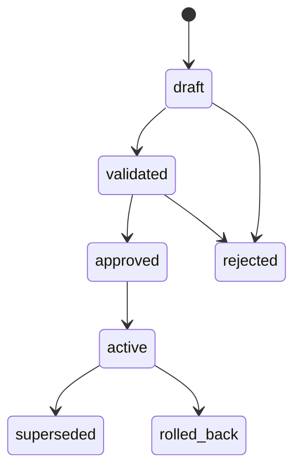

# ADK Multi-Provider Orchestration Architecture (Full IPLAN-009 Migration)

Source baseline: `tmp/IPLAN/IPLAN-009_adk_multi_provider_migration.md`.
This architecture document intentionally preserves the complete IPLAN-009 structure, contracts, workflows, gates, and implementation details.

## 1. Objective
Standardize Tradegent, Tradegent UI, and tradegent_knowledge on a Google ADK agent-centric orchestration architecture while preserving:
- Current analysis quality/depth
- Existing YAML schema and validation rules
- Current UI/API contracts and safety gates
- Current MCP tool ecosystem (IB, RAG, Graph, browser, GitHub)

Target model providers:
- OpenAI
- Vertex AI
- Azure AI Foundry
- OpenRouter

Gateway strategy:
- LiteLLM gateway as provider abstraction, routing, policy, and telemetry plane

---

## 2. Current-State Findings (Documentation Review)

### 2.1 Orchestration and Runtime
- Current core pipeline is in service.py + orchestrator.py with legacy subprocess-based LLM invocations for analysis and execution stages.
- Architecture is host orchestrator + Docker infra services (PostgreSQL, Neo4j, IB Gateway).
- Safety model includes dry_run_mode, auto_execute_enabled, stock state machine, and Do Nothing Gate.
- Runtime orchestration is converging to a single ADK execution path with contract-driven routing.

### 2.2 Data and Knowledge Contracts
- Source of truth is YAML files in tradegent_knowledge/knowledge.
- Derived storage priority is DB first, then RAG, then Graph.
- UI reads kb_* tables directly; SVG generation is deprecated.
- Skill output schemas are versioned (notably stock-analysis v2.7, earnings-analysis v2.6).
- Current docs and skill files show version drift for earnings-analysis (rules expect v2.6 while skill file header is v2.4); migration requires explicit version reconciliation before benchmark baselines.

### 2.3 MCP and Tooling
- Tooling already standardized through MCP servers (ib-mcp, trading-rag, trading-graph, brave-browser, github-vl).
- RAG/Graph already support OpenAI provider env config and partial openrouter support.

### 2.4 UI Agent Layer
- tradegent_ui already has coordinator + specialist agents and MCP integration.
- Existing LLM client uses OpenAI-compatible API surface (base_url + model configurable), which is compatible with LiteLLM.
- UI can adopt ADK in shadow mode earlier than backend; production cutover should occur only after backend parity gates pass.

---

## 3. Target Architecture (ADK-Centric)

## 3.1 Control Plane
- Google ADK becomes the primary agent orchestration framework for:
  - session context
  - tool-calling flow
  - multi-agent composition
  - policy gates
  - retries and reflection loops

## 3.2 Model Plane
- LiteLLM gateway sits between ADK agents and model providers.
- ADK agents call one endpoint for all providers.
- LiteLLM handles:
  - provider routing
  - fallback policy
  - budget/rate limits
  - per-task model selection
  - unified logs/metrics

## 3.3 Tool Plane
- Preserve MCP tool interfaces for market, RAG, Graph, browser, and GitHub.
- Introduce ADK tool adapters wrapping MCP calls; avoid immediate server rewrites.

## 3.4 Data Plane
- Preserve current files-first pipeline:
  - YAML write
  - DB ingest
  - RAG embed
  - Graph extract
- No knowledge-base schema changes in first migration wave (kb_* contracts frozen).
- UI/ops support tables may be extended only if strictly needed for routing/budget telemetry and gated behind migrations.

## 3.5 UI Plane
- Keep current FastAPI and Next.js contracts.
- Introduce ADK behind existing endpoints in shadow mode first, then switch coordinator routing after parity is proven.

## 3.6 Time and Market Governance
- Preserve all timezone-sensitive behavior in America/New_York for market logic, schedules, and gate decisions.
- Keep time-validation checks equivalent to current skill workflows (system time vs market/data time checks).

---

## ADK Orchestrator Design

### Purpose
Define an explicit orchestrator layer for deterministic ADK-native agent execution:
- skill selection and execution lifecycle
- sub-agent delegation for specialized steps
- MCP tool invocation with policy controls
- deterministic run-state tracking and resumability
- interoperability with `tradegent_ui` agents through a shared orchestration contract

### Core Components

##### Core Module Contracts (Explicit)

| Module | Primary Responsibility | Consumes | Produces | Invokes |
|---|---|---|---|---|
| `CoordinatorAgent` | Orchestrates end-to-end run lifecycle and phase progression | request envelope, `SkillExecutionPlan`, tool payloads, sub-agent outputs, policy decisions | final response envelope, authoritative run status | `SkillRouter`, `MCPToolBus`, `SubagentInvoker`, `PolicyGate`, `RunStateStore` |
| `SkillRouter` | Resolves skill graph/version and execution phases | `intent`, `ticker`, `analysis_type`, `constraints`, `contract_version` | `SkillExecutionPlan` | none |
| `SubagentInvoker` | Executes enabled sub-agents for each phase | prepared phase payloads from `CoordinatorAgent` + model routing hints | structured phase outputs (`draft`, `critique`, `repair`, `summary`, etc.) | ADK sub-agents only |
| `MCPToolBus` | Mediates all MCP tool calls with normalized envelopes | tool requests (`tool_name`, `input`, `timeout`, `idempotency_key`, `trace_id`) | normalized tool responses (`status`, `payload`, `error`, `latency_ms`) | MCP servers (IB/RAG/Graph/browser/GitHub) |
| `PolicyGate` | Evaluates policy checkpoints and enforces safety controls | run context, phase outputs, policy bundle | `policy_decisions[]` (`allow|deny|defer`) | none |
| `RunStateStore` | Persists run header/state transitions for replay and audit | state transition events, metadata, policy decisions | durable lifecycle record + latest authoritative status | storage layer only |

#### 1. `CoordinatorAgent`
- Entry point for every run request from CLI (`tradegent.py`), scheduler (`service.py`), and UI.
- Resolves run intent (`analysis`, `scan`, `watchlist`, `journal`, `validation`) and skill identity.
- Creates canonical `run_id`, initializes run context (`ticker`, `analysis_type`, `mode`, `budget`), and starts orchestration.
- Accepts optional `client_request_id` and `idempotency_key` for dedup and tracing; callers do not own canonical `run_id`.
- Owns final response assembly and run completion status.

#### 2. `SkillRouter`
- Maps the resolved intent to a concrete skill workflow graph.
- Loads skill contract metadata (schema version, required phases, validators, allowed tools, retry policy).
- Resolves skill graph/version and phase plan for ADK runtime execution.
- Produces a normalized `SkillExecutionPlan` consumed by `CoordinatorAgent`.

##### SkillRouter Consumer and Usage Contract

`SkillRouter` has exactly one runtime consumer: `CoordinatorAgent`.

| Caller | Calls `SkillRouter`? | When | Input | Output | Notes |
|---|---|---|---|---|---|
| `CoordinatorAgent` | yes | once per new run after `run_id` creation and dedup check | `intent`, `ticker`, `analysis_type`, `constraints`, `contract_version`, engine flags | `SkillExecutionPlan` (phases, validators, allowed tools, retry policy, skill version) | authoritative routing path |
| CLI (`tradegent.py`) | no (indirect only) | request ingress | request envelope to `CoordinatorAgent` | n/a | never bypasses `CoordinatorAgent` |
| Scheduler (`service.py`) | no (indirect only) | scheduled run dispatch | request envelope to `CoordinatorAgent` | n/a | never bypasses `CoordinatorAgent` |
| UI agents (`tradegent_ui`) | no (indirect only) | user-initiated run | request envelope to `CoordinatorAgent` | n/a | never bypasses `CoordinatorAgent` |

Direct calls to `SkillRouter` from UI/CLI/scheduler are out of contract.

#### Runtime Engine Mode

Tradegent runtime uses ADK by default for orchestration.

| Setting | Allowed Value | Behavior |
|---|---|---|
| `AGENT_ENGINE` | `adk` | ADK-only runtime mode |

Runtime guardrail:
- `AGENT_ENGINE` accepts `adk` only.
- Legacy mode is removed from runtime selection paths.

#### 3. `SubagentInvoker`
- Executes delegated specialist tasks as ADK sub-agents (research, critique, risk-check, summarization).
- Applies role-specific model-class routing via LiteLLM (`reasoning_standard`, `critic_model`, etc.).
- Supports bounded retries and structured outputs so downstream validation can be deterministic.
- Uses explicit ADK sub-agent contracts for deterministic multi-agent fan-out.
- Receives prepared phase payloads from `CoordinatorAgent`; does not call `MCPToolBus` directly.
- Consumer rule: sub-agents have one runtime consumer only - `CoordinatorAgent` (via `SubagentInvoker` output envelope). No other module (`SkillRouter`, `MCPToolBus`, `PolicyGate`, `RunStateStore`, UI/CLI/scheduler) may consume sub-agent outputs directly.

##### Sub-Agents Orchestrated by `SubagentInvoker` (Core View)

| Sub-Agent | Primary Use in Core Flow | Typical Phase |
|---|---|---|
| `DraftAnalysisAgent` | Produce first-pass analysis draft | `draft` |
| `CriticAgent` | Detect contradictions and missing rationale/derivations | `critique` |
| `RepairAgent` | Apply critique fixes and emit repaired payload | `repair` |
| `RiskGateAgent` | Perform conditional premium risk/gate synthesis | `risk_gate` |
| `SummaryAgent` | Produce UI-facing summary/metadata | `summarize` |

Note: `SubagentInvoker` executes only the roles enabled by `SkillExecutionPlan` for the current run.

Retrieval ownership rule: pre-analysis retrieval is executed by `MCPToolBus` tool workflows (RAG/Graph/market), not by `SubagentInvoker`.

#### 4. `MCPToolBus`
- Single mediation layer for all tool calls (IB, RAG, Graph, browser, GitHub).
- Normalizes request/response envelopes for MCP calls:
  - `tool_name`, `input`, `timeout`, `idempotency_key`, `trace_id`
  - `status`, `payload`, `error`, `latency_ms`
- Adds shared resilience behavior: timeout budget, retry policy, circuit-breaker hooks.
- Preserves existing MCP server contracts to avoid immediate server rewrites.
- Rule: only `CoordinatorAgent` may invoke `MCPToolBus`; all other modules are indirect consumers through `CoordinatorAgent`.

#### 5. `PolicyGate`
- Evaluates policy checkpoints before and after major phases.
- Mandatory controls:
  - block execution-stage actions when `dry_run_mode=true`
  - enforce stock state restrictions (`analysis`/`paper`/`live` rules)
  - preserve explicit live-trading execution block unless separately approved and implemented as a dedicated safety change
  - enforce budget/token ceilings per run and per skill
  - enforce model/tool allowlist-denylist by operation type
- Produces machine-readable denial reasons for auditability and rollback triggers.

##### PolicyGate Decision Schema

Every policy evaluation emits a normalized decision object in `policy_decisions[]`.

| Field | Type | Required | Description |
|---|---|---|---|
| `decision` | enum | yes | `allow|deny|defer` |
| `checkpoint_id` | string | yes | Stable checkpoint key (for example `pre_execution`, `post_validation`) |
| `reason_code` | string | conditional | Required when `decision` is `deny|defer` |
| `reason_detail` | string | no | Human-readable explanation for audit and UI |
| `policy_bundle_version` | string | yes | Version of applied policy pack |
| `evaluated_at` | datetime string | yes | RFC3339 timestamp |
| `enforcement_mode` | enum | conditional | Applies when `decision` is `deny|defer`; values: `hard_block|soft_warn` |

Semantics note: `enforcement_mode` defines handling for non-allow outcomes (`deny|defer`) and is not required for `allow` decisions.

`reason_code` catalog (minimum set):
- `DRY_RUN_EXECUTION_BLOCKED`
- `STOCK_STATE_NOT_EXECUTABLE`
- `LIVE_EXECUTION_DISABLED`
- `MODEL_DENYLIST_VIOLATION`
- `TOOL_DENYLIST_VIOLATION`
- `BUDGET_CAP_EXCEEDED`
- `POLICY_BUNDLE_MISMATCH`

#### 6. `RunStateStore`
- Persistent state layer for orchestration progress and recovery.
- Stores phase transitions and artifacts by `run_id`:
  - `requested` -> `planned` -> `retrieval_done` -> `draft_done` -> `critique_done` -> `validated` -> `completed|failed|blocked`
- Captures request/response metadata, provider/model usage, policy decisions, and validation outcomes.
- Enables resume/replay after transient failures without re-running completed safe phases.

### RunStateStore Persistence Contract
- Backing store: PostgreSQL `nexus` schema with migration-managed tables for run header and append-only transition events.
- Transaction rule: each state transition is atomic with metadata persistence.
- Side-effect guard: phases that can write YAML or trigger ingest must persist dedup markers before execution.
- Retention policy: configurable hot retention for operational runs and longer audit retention for benchmark/review traces.
- Recovery rule: resume from last committed safe phase only; never re-run side-effect phases without idempotency validation.

#### RunStateStore Runtime Schema (Minimum)

| Table | Purpose | Required Columns |
|---|---|---|
| `nexus.run_state_runs` | Canonical run header | `run_id` (PK), `parent_run_id`, `intent`, `ticker`, `analysis_type`, `status`, `contract_version`, `routing_policy_version`, `effective_config_hash`, `created_at`, `updated_at` |
| `nexus.run_state_events` | Append-only transition/event log | `id` (PK), `run_id` (FK), `from_state`, `to_state`, `phase`, `event_type`, `event_payload_json`, `policy_decisions_json`, `created_at` |

Indexes and constraints (minimum):
- unique index on `run_state_runs.run_id`
- index on `run_state_runs.created_at`
- index on `run_state_events.run_id, created_at`
- check constraint enforcing valid transition set from `INV-002`
- foreign key `run_state_events.run_id -> run_state_runs.run_id`

### Request/Response Flow (ADK Runtime)

#### Request Ingress
1. Caller submits request (`intent`, `ticker`, `analysis_type`, optional overrides, `client_request_id`, `idempotency_key`, `contract_version`) via CLI/UI/scheduler.
2. `CoordinatorAgent` creates `run_id`, binds trace context, and records `requested` in `RunStateStore`.
3. `SkillRouter` resolves the skill and returns `SkillExecutionPlan` with required phases.

#### Phase A: Pre-Analysis Context (matches current skill pre-context step)
4. `CoordinatorAgent` requests context retrieval steps from plan.
5. `MCPToolBus` executes RAG/Graph/market context tools and returns normalized payloads.
6. `RunStateStore` records `retrieval_done` and context artifact references.

#### Phase B: Execute Skill (matches current analysis execution step)
7. `SubagentInvoker` runs draft generation sub-agent using routed model class.
8. `SubagentInvoker` runs critique/repair sub-agent pass when configured.
9. `SubagentInvoker` runs risk synthesis and summary sub-agents when enabled by plan.
10. `CoordinatorAgent` runs validator hooks (schema and gate checks) and records results.

#### Sub-Agent Invocation Timing and Payload Contract

`CoordinatorAgent` invokes sub-agents only when the `SkillExecutionPlan` declares the phase as required or optional-and-enabled.

| Invocation Point | Invoked By | Sub-Agent(s) | Trigger Condition | Minimum Input Payload | Expected Output |
|---|---|---|---|---|---|
| Pre-analysis context | `CoordinatorAgent` via `MCPToolBus` | retrieval tool workflow (RAG/Graph/market) | plan includes retrieval phase | `run_id`, `contract_version`, `skill_name`, `ticker`, `analysis_type`, `constraints`, `routing_policy_version` | normalized context bundle + source references |
| First draft | `CoordinatorAgent` via `SubagentInvoker` | `DraftAnalysisAgent` | after `retrieval_done` | `run_id`, `phase=draft`, context bundle, template contract, constraints, model class | structured draft payload mapped to template fields |
| Critique | `CoordinatorAgent` via `SubagentInvoker` | `CriticAgent` | plan enables critique | `run_id`, `phase=critique`, draft payload, validation hints | `issues[]`, severity, fix hints |
| Repair | `CoordinatorAgent` via `SubagentInvoker` | `RepairAgent` | critique produced issues or plan requires repair pass | `run_id`, `phase=repair`, draft payload, critique report | repaired payload + change summary |
| Risk/gate synthesis | `CoordinatorAgent` via `SubagentInvoker` | `RiskGateAgent` | conditional premium path (near-threshold/low confidence) | `run_id`, `phase=risk_gate`, repaired payload, gate thresholds | `gate_result`, recommendation rationale |
| Summary | `CoordinatorAgent` via `SubagentInvoker` | `SummaryAgent` | final validated payload available | `run_id`, `phase=summarize`, validated payload, UI constraints | concise summary + UI metadata |

All sub-agent calls share mandatory transport envelope fields:
- `run_id`
- `contract_version`
- `skill_name`
- `phase`
- `payload`

All sub-agent outputs are schema-validated before phase advancement.

#### Phase C: Policy and Post-Save (matches current post-save/indexing pattern)
10. `PolicyGate` evaluates final action permissions and safety constraints.
11. If allowed, orchestrator writes YAML (source of truth) and triggers ingest/index chain via existing hooks/tools.
12. `RunStateStore` records final status and immutable run summary.

#### Response Egress
13. `CoordinatorAgent` returns a structured response envelope:
   - `run_id`, `status`, `recommendation`, `gate_result`
   - `artifacts` (yaml path, validation report, ingest status)
   - `telemetry` (provider, model alias, tokens, latency, estimated cost)
   - `policy_decisions` (allow/deny with reasons)

### Idempotency and Dedup Rules
- Dedup key: (`intent`, `ticker`, `analysis_type`, `idempotency_key`, `routing_policy_version`).
- If a matching in-flight run exists, return current run status and `run_id`.
- If a matching completed run exists, return prior result envelope with `dedup_hit=true`.
- Side-effect phases (YAML write, ingest/index) are no-op on dedup replay.
- Idempotency replay window is configuration-controlled and auditable.

### Component Interaction Contract
- `CoordinatorAgent` is the only component allowed to finalize run status.
- `SkillRouter` is the only component allowed to select skill graph/version.
- `SubagentInvoker` never calls MCP directly; all tools route through `MCPToolBus`.
- Sub-agent output consumer is strictly `CoordinatorAgent` only (through `SubagentInvoker`); direct consumption by any other component is out of contract.
- `PolicyGate` can block any transition before side effects.
- `RunStateStore` is append-oriented for audit traceability and rollback diagnostics.
- UI specialist/coordinator agents invoke orchestration through the same `CoordinatorAgent` request envelope and do not bypass policy or state tracking.

### UI Agent Interoperability Contract
- The tradegent orchestrator is the system of record for run lifecycle, even when a run originates from UI agents.
- `tradegent_ui` agents submit requests using the shared envelope (`intent`, `ticker`, `analysis_type`, `constraints`, `trace_id`, `client_request_id`, `idempotency_key`, `contract_version`).
- Orchestrator responses are returned in the shared result envelope (`status`, `recommendation`, `gate_result`, `artifacts`, `telemetry`, `policy_decisions`).
- Streaming UX updates are allowed, but final authoritative status must come from `RunStateStore`.
- UI agents may compose, summarize, and present outputs, but cannot mutate gate outcomes or bypass `PolicyGate`.
- This contract preserves one orchestration path for CLI, scheduler, and UI to avoid behavior drift.

### Contract Versioning and Compatibility
- Request/response envelopes include `contract_version`.
- `contract_version` format is SemVer string only (`MAJOR.MINOR.PATCH`, e.g., `1.2.0`).
- Orchestrator supports N and N-1 `MAJOR` versions during migration windows.
- Compatibility evaluation rule:
  - Accept when `request.contract_version.major` is equal to current major (`N`) or previous major (`N-1`).
  - Reject all other majors with `UNSUPPORTED_CONTRACT_VERSION`.
- Breaking envelope changes require version bump and CI conformance tests before rollout.
- UI cutover cannot proceed without passing contract conformance for all active routes.

### Implementation Contracts

#### Request Envelope Contract (`CoordinatorAgent` Ingress)

| Field | Type | Required | Source | Constraints | Notes |
|---|---|---|---|---|---|
| `contract_version` | string | yes | CLI/UI/scheduler | SemVer only (`MAJOR.MINOR.PATCH`) | Must be supported by orchestrator (N or N-1 major) |
| `intent` | enum | yes | CLI/UI/scheduler | `analysis|scan|watchlist|journal|validation` | Routed by `SkillRouter` |
| `ticker` | string | conditional | CLI/UI/scheduler | uppercase symbol when intent is ticker-scoped | Required for ticker-scoped skills |
| `analysis_type` | enum/string | conditional | CLI/UI/scheduler | skill-compatible type (`stock`, `earnings`, etc.) | Required for analysis intents |
| `constraints` | object | no | UI/CLI | policy-safe overrides only | Cannot bypass `PolicyGate` |
| `trace_id` | string | no | caller or gateway | B3-compatible when present | Correlation for observability |
| `client_request_id` | string | no | CLI/UI/scheduler | caller-generated unique id | For caller-side correlation |
| `idempotency_key` | string | yes | CLI/UI/scheduler | stable across retried equivalent requests | Used by dedup key |

#### Response Envelope Contract (`CoordinatorAgent` Egress)

| Field | Type | Required | Produced By | Constraints | Notes |
|---|---|---|---|---|---|
| `contract_version` | string | yes | `CoordinatorAgent` | mirrors negotiated contract | Returned on all outcomes |
| `run_id` | string | yes | `CoordinatorAgent` | canonical, orchestrator-generated | System of record identifier |
| `status` | enum | yes | `RunStateStore`/`CoordinatorAgent` | `completed|failed|blocked|in_progress` | Reflects authoritative lifecycle state |
| `recommendation` | string/enum | conditional | skill pipeline | present when skill produces decision | Mirrors YAML outcome |
| `gate_result` | enum | conditional | validator/policy layer | `PASS|MARGINAL|FAIL` where applicable | Preserves current gate semantics |
| `artifacts` | object | no | pipeline | paths/refs only, no secret payloads | Includes YAML and validation refs |
| `telemetry` | object | no | runtime | tokens, latency, model alias, cost estimate | Debug/ops usage |
| `policy_decisions` | array/object | yes | `PolicyGate` | machine-readable allow/deny records | Required for auditability |
| `dedup_hit` | boolean | no | dedup layer | true when replayed prior completed result | Enables caller retry safety |

#### Phase State to API Status Mapping

| Latest Committed Phase State | Response `status` | Notes |
|---|---|---|
| `requested|planned|retrieval_done|draft_done|critique_done|validated` | `in_progress` | Run is active and resumable |
| `completed` | `completed` | Terminal success |
| `failed` | `failed` | Terminal failure |
| `blocked` | `blocked` | Terminal policy/safety stop |

#### State Transition Invariants (`RunStateStore`)

| Invariant ID | Rule | Enforced By | Verification |
|---|---|---|---|
| `INV-001` | `run_id` is immutable and unique for canonical run lifecycle | `CoordinatorAgent` + DB unique constraint | unit + DB constraint tests |
| `INV-002` | Allowed transitions only: `requested->planned->retrieval_done->draft_done->critique_done->validated->(completed|failed|blocked)` | transition validator in runtime | state-machine tests |
| `INV-003` | No transition may skip directly to `completed` before `validated` | transition validator | negative transition tests |
| `INV-004` | Side-effect phases require dedup marker persisted before execution | orchestrator middleware + DB transaction | integration tests with retries |
| `INV-005` | Replayed request with same dedup key must not duplicate YAML/ingest side effects | dedup middleware | replay harness tests |
| `INV-006` | `PolicyGate` deny decisions must terminate flow as `blocked` and emit denial reason | `PolicyGate` + `CoordinatorAgent` | policy conformance tests |
| `INV-007` | Final response `status` must match latest committed `RunStateStore` status | `CoordinatorAgent` | contract conformance tests |
| `INV-008` | UI/CLI/scheduler paths share identical orchestrator contract and lifecycle semantics | API boundary + orchestrator adapter | cross-entrypoint parity tests |

#### Contract Conformance Test Minimum Set
- Request schema validation tests for each `intent` and contract version.
- Response schema validation tests for success, blocked, failed, and dedup-hit cases.
- State-machine transition tests including invalid/skip transitions.
- Idempotency replay tests that assert no duplicate side effects.
- UI-to-orchestrator compatibility tests for N and N-1 contract versions.

### Agentic Runtime Mapping
- Skill routing -> `SkillRouter` generated `SkillExecutionPlan`.
- Sub-agent execution -> `SubagentInvoker` with role-specific model classes.
- Tool access -> `MCPToolBus` mediation only.
- Safety and policy -> centralized `PolicyGate` checkpoints.
- State and recovery -> durable `RunStateStore` transitions.
- Entrypoints -> CLI/UI/scheduler all invoke `CoordinatorAgent` boundary.

---

## 4. Provider Routing Strategy (LiteLLM)

## 4.1 Logical Model Classes
- reasoning_premium: high-stakes final synthesis, gate decisions
- reasoning_standard: primary analysis draft
- extraction_fast: parsing, normalization, transform tasks
- critic_model: self-review, contradiction checks
- summarizer_fast: UI summaries and short responses

## 4.2 Provider Mapping (Initial)
- OpenAI:
  - reasoning_premium, reasoning_standard, summarizer_fast
- Vertex AI:
  - reasoning_standard, extraction_fast
- Azure AI Foundry:
  - reasoning_standard fallback, enterprise compliance workloads
- OpenRouter:
  - overflow/fallback, specialized cost/performance routes

## 4.3 Routing Rules
- stock-analysis and earnings-analysis:
  - draft: reasoning_standard
  - critique: critic_model
  - finalize: reasoning_premium only if gate near threshold or low confidence
- watchlist/trade-journal/report-validation:
  - reasoning_standard + summarizer_fast
- UI conversational responses:
  - summarizer_fast by default

## 4.4 Hard Policies
- No execution-stage agent call when dry_run_mode=true.
- Enforce model denylist for order placement operations.
- Enforce per-skill max token and max retries.

## 4.5 Provider Scope by Capability
- Chat/reasoning: routed via LiteLLM across OpenAI, Vertex AI, Azure AI Foundry, OpenRouter.
- Embeddings: migrate to LiteLLM-compatible path in a dedicated phase; until then keep existing RAG embedding providers stable.
- Extraction/classification (Graph): migrate with feature flags; maintain existing extractor compatibility during transition.

---

## 5. Migration Scope by Repository

## 5.1 tradegent
### Workstream A: ADK Runtime Foundation
- Add adk_runtime package:
  - agent registry
  - tool adapter layer (MCP wrappers)
  - policy middleware (safety/gates)
  - run context model (ticker, skill, mode, budget)
- Add litellm client module:
  - provider aliases
  - timeout/retry policy
  - token/cost accounting hooks

### Workstream B: Skill Orchestration Port
- Port highest-value skills first:
  - stock-analysis
  - earnings-analysis
  - scan
  - watchlist
- Keep existing YAML templates and validators unchanged.
- Implement multi-pass generation:
  - generate -> critique -> repair -> validate

### Workstream C: Orchestrator Integration
- Add feature flag strategy:
  - `AGENT_ENGINE=adk` (default runtime mode)
- Keep existing commands unchanged for users.
- Route analyze/run-scanners through ADK path by default.

### Workstream D: Observability
- Emit per-agent spans and cost metrics:
  - model, provider, input_tokens, output_tokens, latency_ms, cost_usd
- Correlate with existing B3 trace IDs.

## 5.2 tradegent_ui
### Workstream E: Agent Backend Swap
- Keep REST/WS response contract and A2UI schema unchanged.
- Replace internal coordinator execution path with ADK orchestrator.
- Preserve mcp_client until ADK-native tools are stable.
- Keep fallback execution confined to internal testing paths; do not expose deprecated CLI analysis commands.
- Route UI specialist agent requests through tradegent `CoordinatorAgent` so UI and backend share one skill orchestration path.

### Workstream F: LLM Client Refactor
- Replace direct AsyncOpenAI base_url usage with shared LiteLLM client.
- Add per-intent model class selection.
- Add user/org budget guardrails in UI requests.

### Workstream G: UX Safeguards
- Add response metadata in debug mode:
  - provider, model alias, latency, token usage, estimated cost
- Preserve auth/RBAC boundaries (no permission broadening in migration).

## 5.3 tradegent_knowledge
### Workstream H: Skill Contract Stabilization
- Freeze schema versions for migration window.
- Publish explicit machine-checkable contract docs:
  - required fields
  - allowed enums
  - derivation requirements
- Add migration test fixtures (golden YAML outputs).

### Workstream I: Quality Bench Corpus
- Curate benchmark set from historical analyses:
  - PASS, MARGINAL, FAIL examples
  - edge-case tickers and market regimes
- Use corpus for A/B validation across providers.

---

## 6. Delivery Phases

## Phase -1: Baseline and Version Reconciliation
- Reconcile skill/rule/template version mismatches (especially earnings-analysis).
- Snapshot baseline quality, latency, and cost from current engine.
- Freeze benchmark corpus and validation scripts used for A/B.

Exit criteria:
- Version matrix approved for skills/rules/templates
- Baseline report published and signed off

## Phase 0: Readiness and Design Freeze
- Finalize non-functional requirements:
  - latency budgets
  - cost budgets
  - minimum quality scores
- Freeze schema contracts for stock/earnings/watchlist/trade-journal.
- Define model alias catalog and routing policy in LiteLLM.

Exit criteria:
- Approved ADR for ADK + LiteLLM architecture
- Approved quality/cost acceptance criteria

## Phase 1: LiteLLM Gateway and Shared SDK
- Deploy LiteLLM service.
- Add provider credentials and fallback chains.
- Implement shared Python SDK used by tradegent and tradegent_ui.

Exit criteria:
- Health checks green for all configured providers
- Deterministic fallback tested (forced provider outage)

## Phase 2: ADK Skeleton + Tool Adapters
- Implement ADK base agent abstractions.
- Wrap MCP tools in ADK-compatible tool interfaces.
- Add session context and memory boundaries.

Exit criteria:
- ADK agents can execute representative MCP workflows end-to-end

## Phase 3: Skill Migration Wave 1
- Port stock-analysis and earnings-analysis to ADK.
- Keep validators and output templates unchanged.
- Enable A/B run mode:
  - old CLI path and ADK path in parallel for same ticker set

Exit criteria:
- >= 98% schema validation pass rate
- gate_result agreement >= 90% vs baseline
- no degradation in risk controls

## Phase 4: Skill Migration Wave 2
- Port scan, watchlist, trade-journal, report-validation.
- Add queue-based orchestration for chained workflows.

Exit criteria:
- full daily routine executes in ADK mode
- no critical regressions in chaining behavior

## Phase 5: UI Integration and Cutover
- Switch UI agent backend to ADK runtime after shadow-mode parity from earlier phases.
- Keep endpoint signatures and A2UI payloads stable.

Exit criteria:
- UI regression suite pass
- no increase in auth/RBAC defects
- shared contract version conformance tests pass (`tradegent_ui` <-> `CoordinatorAgent`)

## Phase 6: Production Hardening (ongoing)
- Cost/performance tuning per provider route.
- Add canary release and rollback runbooks.
- Decommission Claude CLI path after stability window.

---

## 7. Quality and Acceptance Framework

## 7.1 Functional KPIs
- schema_validation_pass_rate >= 98%
- required_derivation_completeness = 100% (stock v2.7 critical fields)
- gate_threshold_integrity = 100% (no threshold drift)
- workflow_chain_success_rate >= 95%

## 7.2 Decision-Quality KPIs
- gate_result_agreement_vs_baseline >= 90%
- recommendation_agreement_vs_baseline >= 85%
- confidence_calibration_error not worse than baseline

## 7.3 Operational KPIs
- p95_analysis_latency_ms <= 180000 for `stock-analysis|earnings-analysis`
- p95_analysis_latency_ms <= 90000 for `scan|watchlist|trade-journal|report-validation`
- p95_mcp_call_error_rate <= 2.0%
- median_cost_per_analysis_usd <= 1.15 * baseline_median_cost_per_analysis_usd
- p95_cost_per_analysis_usd <= configured_skill_budget_cap_usd

## 7.4 Safety KPIs
- unauthorized_execution_events = 0
- dry_run_policy_violations = 0
- RBAC bypass incidents = 0

---

## 8. A/B Benchmark Methodology

## Dataset
- Use historical corpus from tradegent_knowledge/knowledge/analysis:
  - stock analyses (diverse outcomes)
  - earnings analyses around event windows

## Protocol
- Run both engines on same input pack:
  - market snapshot
  - retrieved context
  - skill template version
  - routing policy version and model alias map hash
  - tool output mode (`record` or `replay`)
- Compare:
  - YAML validation
  - key field deltas
  - gate decision and rationale
  - token/cost/latency

## Deterministic Replay Controls
- Record MCP tool responses for benchmark samples and replay same payloads for baseline vs ADK comparisons.
- Persist prompt/build metadata (`skill_version`, `contract_version`, `routing_policy_version`, model alias hash).
- Report orchestration variance separately from model stochastic variance.
- Reject benchmark samples with incomplete replay metadata.

## Adjudication
- Automated checks for schema and numeric constraints.
- Human review only for semantic disagreement cases.

---

## 9. Security, Compliance, and Secrets

- Centralize model/provider secrets in one secrets backend.
- No provider keys in repo or skill files.
- Preserve existing auth controls in UI and API.
- Add outbound egress allowlist for provider endpoints.
- Add per-provider PII/data-classification routing policies.

---

## 10. Risks and Mitigations

## Risk 1: Quality regression in high-depth analyses
- Mitigation: mandatory critique-repair loop and strict validators.

## Risk 2: Increased latency from multi-pass pipelines
- Mitigation: parallelize retrieval/tool steps; conditional premium pass.

## Risk 3: Cost spikes from premium model overuse
- Mitigation: route-by-difficulty and daily budget caps at LiteLLM.

## Risk 4: Provider outages
- Mitigation: deterministic fallback chains and circuit breakers.

## Risk 5: Schema drift during migration
- Mitigation: schema freeze + golden fixtures + CI validation gates.

---

## 11. Rollback Strategy

- Feature flags at each boundary:
  - AGENT_ENGINE
  - ADK_SKILL_<NAME>_ENABLED
  - LITELLM_ROUTING_POLICY_VERSION
- Blue/green or canary for ADK runtime.
- Instant rollback to last known-good ADK routing/policy configuration if any critical KPI breaches.

Rollback trigger examples:
- schema pass < 95% over rolling 100 runs
- unauthorized execution incident
- p95 latency > 2x baseline sustained

Operational rollback path:
- Keep `AGENT_ENGINE=adk`.
- Revert `LITELLM_ROUTING_POLICY_VERSION` and agent config set to last known-good versions.
- Disable affected ADK skill flags (`ADK_SKILL_<NAME>_ENABLED=false`) where targeted rollback is needed.

---

## 12. Detailed Implementation Backlog (Initial)

## Epic A: Platform Foundation
1. Add LiteLLM service deployment and config manifests.
2. Create shared llm_gateway client package for both repos.
3. Implement provider alias registry and routing policy loader.
4. Enforce runtime config validation with ADK-only engine mode (`AGENT_ENGINE=adk`).

## Epic B: ADK Runtime in tradegent
5. Add adk_runtime package (agent base, tool runner, middleware).
6. Implement MCP tool adapters (IB, RAG, Graph, browser, GitHub).
7. Implement run context and policy enforcement middleware.
8. Implement RunStateStore tables, append-only transition log, and idempotency/dedup index.

## Epic C: Skill Migration
9. Port stock-analysis workflow to ADK multi-pass flow.
10. Port earnings-analysis workflow to ADK multi-pass flow.
11. Integrate existing validate_analysis script in loop.
12. Port scan/watchlist/trade-journal/report-validation.

## Epic D: UI Migration
13. Add ADK coordinator in tradegent_ui/agent.
14. Switch llm_client to shared LiteLLM gateway SDK.
15. Maintain A2UI contract and route specialist tasks to ADK graph.
16. Add contract-version negotiation and conformance tests for UI agent routes.

## Epic E: QA + Operations
17. Build regression harness for YAML and gate comparisons.
18. Add telemetry dashboards for provider/model/cost KPIs.
19. Add deterministic replay harness for MCP and routing metadata capture.
20. Write runbooks for incident response and rollback.
21. Add deployment updates for Docker/systemd (LiteLLM service, health checks, startup ordering).

---

## 13. Suggested Repository Change Map

## tradegent
- New: tradegent/adk_runtime/
- New: tradegent/llm_gateway/
- Update: tradegent/orchestrator.py (engine switch)
- Update: tradegent/service.py (scheduler integration)
- Update: tradegent/tradegent.py (CLI routing to engine switch)
- Update: tradegent scripts for benchmark and A/B runs

## tradegent_ui
- New: tradegent_ui/agent/adk/
- Update: tradegent_ui/agent/llm_client.py
- Update: tradegent_ui/agent/coordinator.py
- Update: tradegent_ui/server config for gateway + routing policies

## tradegent_knowledge
- Update: skill contract docs + fixtures
- New: benchmark fixture sets and expected outputs

---

## 14. Execution Order Recommendation

1. LiteLLM gateway and shared SDK first
2. ADK runtime and adapters second
3. stock-analysis and earnings-analysis migration third
4. UI shadow integration fourth (same endpoints, no hard cutover)
5. lower-risk skills and full cutover last

This order minimizes business risk because high-value analysis quality is proven before broad workflow cutover.

---

## 15. Immediate Next Actions

1. Approve this migration architecture and phase gates.
2. Create ADR for ADK + LiteLLM provider abstraction.
3. Reconcile skill/rules version matrix (stock/earnings) and lock baseline contracts.
4. Define model alias matrix and per-skill routing policy v1.
5. Stand up LiteLLM in dev and connect one provider from each class.
6. Implement benchmark harness and run first baseline snapshot.

---

## 16. Definition of Done (Program Level)

- ADK is the default engine for tradegent and tradegent_ui.
- Runtime operates in ADK-default orchestration mode.
- Legacy mode is removed; runtime execution is ADK-only.
- All critical skills pass schema and gate quality thresholds.
- Multi-provider routing works through LiteLLM with enforced policies.
- Cost and latency are observable and within approved budgets.
- Runbooks and rollback paths are tested and documented.

---

## 17. Service Compatibility and Non-Breaking Constraints

The migration must preserve operational contracts for infrastructure and observability services currently used by tradegent and tradegent_ui.

### 17.1 Infrastructure Service Contract Matrix

| Service | Current Contract (Must Preserve) | Breaking Change Examples | Required Safeguard |
|---|---|---|---|
| PostgreSQL (`pgvector`) | Host access via `localhost:5433`; `nexus` schema; existing `kb_*` and runtime tables; psycopg dict-row usage | Port/schema rename, dropped columns, incompatible migration order | Backward-compatible migrations only; contract tests for critical tables/views |
| Neo4j | Host access `bolt://localhost:7688` and HTTP `:7475`; graph extraction/read flows unchanged | URI/port drift, auth/env contract drift | Keep connection contract stable during ADK cutover |
| IB Gateway (paper/live) | Paper on `4002`, live on `4001`; mode-aware safety semantics | Port remap without adapter update; live-mode policy bypass | Enforce mode policy in `PolicyGate`; preflight parity checks |
| IB MCP | HTTP MCP endpoint `http://localhost:8100/mcp` | Endpoint/path change | Keep endpoint stable or add compatibility adapter |
| RAG MCP | Existing stdio command contract from tradegent runtime | Command/env contract changes | Maintain MCP adapter compatibility layer |
| Graph MCP | Existing stdio command contract from tradegent runtime | Command/env contract changes | Maintain MCP adapter compatibility layer |
| Metabase | Depends on postgres health and existing DB credentials/port assumptions | DB host/port drift breaks BI | Keep DB contract and health order intact |

### 17.2 Observability Stack Contract Matrix

| Service | Current Contract (Must Preserve) | Breaking Change Examples | Required Safeguard |
|---|---|---|---|
| OTEL Collector | OTLP gRPC `:4317`, OTLP HTTP `:4318`, metrics `:8888`; receives traces/metrics/logs | Endpoint/protocol mismatch, exporter incompatibility | Preserve OTLP endpoint env contract and exporter mode semantics |
| Tempo | Trace backend on `:3200` (via collector export) | Collector export route drift | Keep trace pipeline intact and queryable in Grafana |
| Loki | Log backend on `:3100`; fed by Promtail/OTEL logs | Label/schema drift, ingestion path mismatch | Preserve log shipping pipeline and labels used in dashboards |
| Prometheus | Metrics API on `:9090`; remote-write receiver enabled | Metrics exporter path/format incompatibility | Preserve metrics ingestion and scrape targets |
| Grafana | UI on `:3000`; provisioned datasources/dashboards | Datasource UID drift, dashboard breakage | Keep datasource contracts; run dashboard smoke tests |
| Promtail | Journald/file scraping for tradegent logs | Service/unit naming changes break scrape selectors | Preserve service naming/labels or update promtail config with compatibility mapping |

### 17.3 Application Runtime Contracts

| Area | Current Contract (Must Preserve) | Breaking Change Examples | Required Safeguard |
|---|---|---|---|
| Correlation/Tracing | B3-compatible propagation (`X-B3-TraceId`) and correlation IDs in logs | Header removal or mismatch across UI/backend | Contract tests for request/response trace headers |
| Logging | Structured JSON logs with rotation; shared logging module behavior | Format changes breaking Loki/Grafana parsing | Keep JSON structure and key fields stable during migration |
| Health endpoints | `tradegent` health endpoint and `tradegent_ui` `/health` + `/ready` behavior | Path/status contract drift | Add health endpoint compatibility tests |
| UI Docker contract | UI API/WS ports and env assumptions; external `tradegent-network` usage | Network/port/env drift during backend switch | Preserve compose env and network compatibility |
| Scheduler/preflight | Preflight checks for DB/Graph/IB MCP/market time remain valid | ADK migration bypasses preflight assumptions | Keep preflight integration and readiness gating |

### 17.4 Database Compatibility Invariants

- Do not rename or drop `nexus.service_status.state`; service health logic depends on this field.
- Preserve `nexus.run_history.raw_output` contract for historical/audit compatibility.
- Keep `nexus.schedules.task_type` semantics unchanged during ADK engine introduction.
- Keep `kb_*` tables query-compatible for UI dashboards and analysis views.
- Apply additive-first migrations with rollback scripts for all ADK runtime tables (`RunStateStore` additions included).

### 17.5 Observability Compatibility Invariants

- Preserve `OTEL_EXPORTER_TYPE` and `OTEL_EXPORTER_OTLP_ENDPOINT` behavior across tradegent and tradegent_ui.
- Maintain B3 propagation and correlation IDs across HTTP and internal agent boundaries.
- Ensure traces, logs, and metrics remain queryable in existing Grafana datasources without dashboard rewrites.
- Keep log shipping compatibility for both OTEL log export and Promtail/journald path.

---

## 18. Cross-Service Compatibility Validation Gates

### 18.1 Mandatory Pre-Cutover Checks

1. Infrastructure health parity:
  - postgres (`5433`), neo4j (`7688`), ib gateway mode port (`4002` or `4001`), ib-mcp (`8100`).
2. Observability ingestion parity:
  - OTEL collector receiving spans/metrics/logs.
  - Tempo trace search operational.
  - Loki log query operational.
  - Prometheus metrics query operational.
  - Grafana dashboards load with no broken datasource errors.
3. Application contract parity:
  - `tradegent_ui` `/health` and `/ready` unchanged.
  - B3 headers present in responses and log correlation continuity verified.
  - Default runtime remains `AGENT_ENGINE=adk`.
  - Legacy engine fallback is removed; no CLI analyze fallback path.

### 18.2 Non-Breaking CI Gate Set

- `compose-contract` gate: validate expected service ports/env keys/startup dependencies.
- `db-contract` gate: verify critical tables/columns/views (`service_status.state`, `run_history.raw_output`, `schedules.task_type`, `kb_*`).
- `otel-contract` gate: verify exporter config and end-to-end telemetry delivery.
- `dashboard-smoke` gate: validate Grafana datasource connectivity and key dashboard queries.
- `health-contract` gate: verify service and UI health endpoint response schema/status.
- `preflight-parity` gate: quick and full preflight must pass in ADK mode before cutover.

### 18.3 Rollback Triggers (Cross-Service)

- Loss of telemetry ingestion in any one of traces/logs/metrics pipelines for sustained interval.
- Any compatibility gate failure affecting postgres schema contracts or UI health contracts.
- Preflight regression that blocks analysis readiness in ADK mode.
- Grafana dashboard critical query failures caused by migration changes.

### 18.4 Rollback Action

- Keep runtime in `AGENT_ENGINE=adk` mode.
- Revert to last known-good routing policy, agent config set, and observability configuration.
- Disable affected ADK skill flags for targeted containment where required.

---

## 19. Sub-Agent Catalog and Execution Matrix

This section defines concrete sub-agent contracts for ADK execution to keep agentic behavior deterministic, auditable, and high-depth.

### 19.1 Sub-Agent Catalog

| Sub-Agent | Primary Responsibility | Model Class | Allowed Tool Families | Required Input | Required Output | Failure Policy |
|---|---|---|---|---|---|---|
| `ContextRetrievalAgent` | Gather pre-analysis context from RAG/Graph/market state | `extraction_fast` | `mcp__trading-rag__*`, `mcp__trading-graph__*`, `mcp__ib-mcp__get_*` | `ticker`, `analysis_type`, `run_id` | normalized context bundle with source refs | retry 2x then continue with degraded context flag |
| `DraftAnalysisAgent` | Produce first-pass analysis draft aligned to skill template | `reasoning_standard` | no direct MCP (context only) | context bundle, skill contract, constraints | structured draft payload mapped to YAML template fields | retry 1x, then fail phase |
| `CriticAgent` | Identify contradictions, missing derivations, weak rationale | `critic_model` | no direct MCP | draft payload, validation hints | critique report (`issues[]`, severity, fix hints) | retry 1x, then mark critique degraded |
| `RepairAgent` | Apply critique fixes and produce repair candidate | `reasoning_standard` | no direct MCP | draft payload + critique report | repaired payload with change summary | retry 1x, else keep best valid draft |
| `RiskGateAgent` | Evaluate gate semantics and recommendation consistency | `reasoning_premium` (conditional) | no direct MCP | repaired payload + gate thresholds | `gate_result`, recommendation, confidence rationale | skip premium pass when confidence clearly above/below threshold |
| `SummaryAgent` | Generate UI-facing concise summary and metadata | `summarizer_fast` | no direct MCP | final validated payload | summary block + UI metadata | fallback to template-based summary |

### 19.2 Global Sub-Agent Rules

- All MCP access is mediated only through `MCPToolBus`; sub-agents do not call MCP directly.
- Every sub-agent invocation must include `run_id`, `contract_version`, and `routing_policy_version` for replayability.
- Outputs must be schema-validated before entering next phase.
- `PolicyGate` can block progression after any sub-agent phase.
- Any degraded phase must be recorded in `RunStateStore` and surfaced in `telemetry`.

### 19.3 Execution Matrix by Skill

| Skill | Phase Sequence | Mandatory Agents | Optional Agents | Exit Condition |
|---|---|---|---|---|
| `stock-analysis` | context -> draft -> critique -> repair -> risk_gate -> validate -> summarize | `ContextRetrievalAgent`, `DraftAnalysisAgent`, `CriticAgent`, `RepairAgent` | `RiskGateAgent` (conditional premium), `SummaryAgent` | schema pass + gate fields complete + recommendation emitted |
| `earnings-analysis` | context -> draft -> critique -> repair -> risk_gate -> validate -> summarize | `ContextRetrievalAgent`, `DraftAnalysisAgent`, `CriticAgent`, `RepairAgent` | `RiskGateAgent`, `SummaryAgent` | schema pass + scenario/gate integrity complete |
| `scan` | context -> draft -> validate -> summarize | `ContextRetrievalAgent`, `DraftAnalysisAgent` | `SummaryAgent` | candidate list validated + routing decision emitted |
| `watchlist` | context -> draft -> validate -> summarize | `ContextRetrievalAgent`, `DraftAnalysisAgent` | `SummaryAgent` | trigger/invalidation/expiry fields valid |
| `trade-journal` | context -> draft -> validate -> summarize | `DraftAnalysisAgent` | `SummaryAgent` | journal record valid + linkage fields present |
| `report-validation` | context -> draft -> critique -> validate -> summarize | `ContextRetrievalAgent`, `DraftAnalysisAgent`, `CriticAgent` | `SummaryAgent` | `CONFIRM|SUPERSEDE|INVALIDATE` emitted with rationale |

### 19.4 Sub-Agent I/O Contract Keys

#### Input Envelope (all sub-agents)
- `run_id` (string, required)
- `contract_version` (string, required)
- `skill_name` (string, required)
- `ticker` (string, conditional)
- `analysis_type` (string, conditional)
- `phase` (string, required)
- `payload` (object, required)
- `constraints` (object, optional)

#### Output Envelope (all sub-agents)
- `run_id` (string, required)
- `phase` (string, required)
- `status` (`ok|degraded|failed`, required)
- `payload` (object, required on `ok|degraded`)
- `issues` (array, optional)
- `metrics` (`latency_ms`, `tokens_in`, `tokens_out`, `model_alias`, required)

### 19.5 Sub-Agent Failure Handling Matrix

| Failure Type | Handling | RunStateStore Status | Caller Response |
|---|---|---|---|
| MCP context timeout | retry by `MCPToolBus`, then degrade | `retrieval_done` with degraded flag | continue with warning in telemetry |
| Draft generation failure | one retry then fail | `failed` | return structured error envelope |
| Critic failure | mark critique degraded | `critique_done` degraded | continue to repair with limited critique |
| Repair failure | keep last best valid draft | `validated` or `failed` based on validator result | return with `degraded=true` if valid |
| Policy denial | hard stop | `blocked` | return deny reason in `policy_decisions` |

### 19.6 Conformance Tests for Sub-Agents

- Per-agent schema tests for input/output envelopes.
- Tool isolation tests: sub-agents cannot bypass `MCPToolBus`.
- Deterministic replay tests with fixed context payloads.
- Cross-skill matrix tests validating required phase sequence.
- Degraded-path tests confirming telemetry and status propagation.

### 19.7 Execution Sub-Agent Matrix (Open/Close/Fill)

This matrix extends the unified sub-agent pattern to execution workflows so analysis and trade lifecycle share the same orchestration model.

| Flow | Phase Sequence | Mandatory Components | Optional Components | Policy/Safety Requirements | Exit Condition |
|---|---|---|---|---|---|
| `open-trade execution` | precheck -> order_plan -> policy_check -> place_order -> verify_order -> journal_update -> summarize | `ContextRetrievalAgent`, `OrderPlanningAgent`, `OrderPlacementAgent`, `ExecutionVerifierAgent`, `JournalSyncAgent`, `SummaryAgent`, `PolicyGate` checkpoint | `RiskGateAgent` for borderline risk cases | must enforce `dry_run_mode`, stock state policy, model/tool allowlist, budget caps before `place_order` | order placed/queued with broker id and trade journal linkage persisted |
| `close-trade execution` | precheck -> exit_plan -> policy_check -> place_exit_order -> verify_order -> journal_close -> summarize | `ContextRetrievalAgent`, `OrderPlanningAgent`, `OrderPlacementAgent`, `ExecutionVerifierAgent`, `JournalSyncAgent`, `SummaryAgent`, `PolicyGate` checkpoint | `RiskGateAgent` for discretionary exits | must enforce close permissions, position existence checks, and deny execution on policy violation | position close intent recorded, exit order status captured, journal close fields updated |
| `order execution/fill verification` | fetch_order_state -> fetch_fills -> reconcile -> slippage_check -> anomaly_flag -> post_fill_update -> summarize | `ContextRetrievalAgent`, `ExecutionVerifierAgent`, `FillQualityAgent`, `JournalSyncAgent`, `SummaryAgent` | `RepairAgent` (normalization/reconciliation fix-ups) | no mutation of broker state; read/verify path only unless explicit remediation policy is enabled | fill quality result emitted; reconciliation status + review trigger recorded |

### 19.8 Execution-Specific Sub-Agent Roles

| Sub-Agent | Execution Role | Allowed Tool Families | Required Output |
|---|---|---|---|
| `OrderPlanningAgent` | Build executable order intent (side, size, type, limits) from approved strategy | no direct MCP (input from context + policy) | `order_plan` object with rationale and constraints |
| `OrderPlacementAgent` | Submit order via broker tool path | `mcp__ib-mcp__place_order` (through `MCPToolBus`) | broker acknowledgement (`order_id`, state, timestamp) |
| `ExecutionVerifierAgent` | Verify order/fill states and detect mismatches | `mcp__ib-mcp__get_orders`, `mcp__ib-mcp__get_executions`, `mcp__ib-mcp__get_positions` (through `MCPToolBus`) | reconciliation report + fill status |
| `FillQualityAgent` | Compute slippage, timing quality, and anomaly indicators | read-only execution/market data tools via `MCPToolBus` | fill-quality metrics and grade |
| `JournalSyncAgent` | Persist execution outcome linkage to trade journal/review records | no direct MCP | journal patch payload + linkage refs |

`DraftAnalysisAgent` is analysis-only and is no longer used for execution planning after migration cutover.

### 19.9 Execution Contract and Invariants

- All execution mutations (`place_order`) require a successful `PolicyGate` decision in the same run.
- `OrderPlacementAgent` is the only execution role allowed to trigger broker mutation calls.
- Fill/reconciliation agents are read-only and cannot submit/cancel orders.
- Every execution flow must emit broker identifiers and map them to journal records in `RunStateStore`.
- On partial fill, flow remains `in_progress` until reconciliation criteria are met or timeout policy is reached.
- On policy denial, execution flow terminates as `blocked` with explicit denial reason in response envelope.

### 19.10 IB MCP Capability Profile and Fallback Ladder

Execution verification must adapt to available IB MCP endpoints without breaking workflow semantics.

| Capability Tier | Required Endpoints | Verification Approach | Status |
|---|---|---|---|
| Tier A (Preferred) | `get_orders`, `get_executions`, `get_positions` | full order + fill reconciliation | full fidelity |
| Tier B (Compatible) | `get_positions` + persisted `order_id` status snapshots | position delta + broker ack reconciliation | degraded, acceptable |
| Tier C (Minimal) | `get_positions` only | minimal verification with anomaly flag | degraded, manual review required |

Fallback order: Tier A -> Tier B -> Tier C. Pre-cutover gates must declare active capability tier per environment.

### 19.11 Execution Workflow Mapping to Existing Skills

| Execution Flow | Primary Skill Mapping | Secondary/Follow-up Skill Mapping |
|---|---|---|
| `open-trade execution` | `trade-journal` (entry path) | `options-management` (precheck when options position) |
| `close-trade execution` | `trade-journal` (exit path) | `position-close-review` |
| `order execution/fill verification` | `fill-analysis` | `post-trade-review` (on completed close) |

### 19.12 Partial Fill Defaults and Escalation Policy

- verification poll interval: `15s`
- max verification window: `10m`
- reconciliation retry budget: `20`
- escalation thresholds:
  - warning at `2m` unresolved partial fill
  - critical at `10m` unresolved partial fill
- terminal outcomes:
  - `completed` when expected fill criteria are met
  - `blocked` on policy/manual hold
  - `failed` on timeout (`partial_fill_timeout` reason code)

### 19.13 Execution Conformance Tests

- Open-trade flow tests: policy pass/deny, dry-run enforcement, broker ack capture.
- Close-trade flow tests: valid close, missing position, deny path behavior.
- Fill verification tests: partial fill, stale order state, reconciliation mismatch handling.
- Mutation isolation tests: only `OrderPlacementAgent` can call placement operations.
- Journal linkage tests: execution IDs and trade journal records remain referentially consistent.
- Capability tier tests: Tier A/B/C fallback behavior and degraded telemetry flags.

### 19.14 Analysis-to-Execution Handoff Contract

This contract defines who executes a trade when analysis finds a valid opportunity and how the handoff is performed.

#### Ownership
- `CoordinatorAgent` owns handoff orchestration.
- Analysis workflow produces an `ExecutionIntent` payload when execution-eligible.
- Execution workflow consumes `ExecutionIntent` and runs open/close/fill flows through `SubagentInvoker`.

#### Handoff Preconditions (all required)
- `gate_result` is execution-eligible (`PASS` by default; `MARGINAL` only if explicit policy allows).
- `dry_run_mode=false`.
- `auto_execute_enabled=true`.
- Stock state permits execution (paper/live policy rules; live execution block remains unless separately approved).
- Required order fields available (`ticker`, side, size policy, entry/exit constraints, risk bounds).

#### `ExecutionIntent` Minimum Schema
- `run_id` (analysis run id)
- `contract_version`
- `source_skill` (`stock-analysis|earnings-analysis|scan|watchlist`)
- `ticker`
- `action` (`open|close|verify_fill`)
- `order_plan_ref` (reference to validated plan payload)
- `gate_result`
- `risk_context` (position limits, stop/target constraints)
- `trigger_reason` (why handoff occurred)
- `created_at`

#### Handoff Transport and Persistence
- Persist `ExecutionIntent` to `RunStateStore` and queue record (`nexus.task_queue`) before execution starts.
- Use idempotency key derived from (`ticker`, `action`, `order_plan_ref`, `routing_policy_version`) to avoid duplicate execution.
- Execution run references parent analysis `run_id` for lineage and audit.

#### `nexus.task_queue` Contract (Execution Handoff)
- `nexus.task_queue` is an existing queue contract and remains the handoff queue for execution intents in this migration scope.
- Minimum required columns: `id`, `task_type`, `payload_json`, `status`, `created_at`, `updated_at`, `trace_id`, `idempotency_key`.
- Required semantics:
  - `task_type` must support `execution_handoff`.
  - `payload_json` must include `ExecutionIntent` and `parent_run_id`.
  - `idempotency_key` must be unique for active queue items to prevent duplicate execution dispatch.
- Compatibility rule: additive-only queue changes; no breaking rename/drop of required columns during migration.
- Validation gate: CI `db-contract` must verify presence and compatibility of `nexus.task_queue` before ADK execution cutover.

#### Handoff Outcomes
- `accepted`: execution workflow started.
- `deferred`: queued for later trigger window (market hours/policy window).
- `blocked`: policy/safety denied with explicit reason.
- `discarded`: intent invalidated (stale analysis or superseded intent).

### 19.15 Execution Trigger Matrix

| Trigger Source | Trigger Condition | Workflow Started | Owner | Notes |
|---|---|---|---|---|
| Analysis completion | Analysis emits execution-eligible `ExecutionIntent` and handoff preconditions pass | `open-trade execution` | `CoordinatorAgent` | Primary automatic path |
| Manual user action (UI/CLI) | User confirms open/close/verify action | `open-trade` or `close-trade` or `fill verification` | `CoordinatorAgent` | Must still pass `PolicyGate` |
| Scheduler due task | Due schedule with execution-enabled policy | `open-trade` or `close-trade` | Service scheduler + `CoordinatorAgent` | Respects market-hour and safety settings |
| Watchlist trigger | Entry/exit trigger condition met and policy allows | `open-trade` or `close-trade` | Watchlist monitor + `CoordinatorAgent` | Requires trigger/invalidation checks |
| Position/order monitor | Broker state change, partial fill, or close detected | `order execution/fill verification` or `close-trade` follow-up | Monitor service + `CoordinatorAgent` | Drives reconciliation and review linkage |
| Retry/reconcile timer | Unresolved partial fill within retry window | `order execution/fill verification` | `CoordinatorAgent` | Uses 15s poll, 10m max window defaults |

#### Trigger Gating Rules
- No trigger can bypass `PolicyGate`.
- Triggers that would mutate broker state are blocked in dry run.
- Duplicate triggers resolve via idempotency/dedup before execution starts.
- Trigger processing order: safety-critical (`close`, `verify_fill`) before new opens when resource limits conflict.

---

## 20. Agent Configuration Architecture

This section defines a unified configuration model for orchestrator agents and sub-agents with per-role flexibility and safe defaults.

### 20.1 Configuration Objectives

- Per-agent and per-sub-agent configurability without code changes.
- Deterministic override precedence (global -> workflow -> agent -> sub-agent -> runtime override).
- Policy-safe operation (no config can bypass `PolicyGate` safety constraints).
- Hot-reload support with auditability and rollback.

### 20.2 Configuration Scope

| Scope | Description | Example |
|---|---|---|
| `global` | Platform-wide defaults | default timeout, global budget caps |
| `workflow` | Overrides for analysis or execution flow families | `stock-analysis`, `open-trade execution` |
| `agent` | Settings for orchestrator components | `CoordinatorAgent`, `MCPToolBus` |
| `sub_agent` | Settings for specialist roles | `CriticAgent`, `OrderPlacementAgent` |
| `runtime_override` | Per-run constrained overrides | debug-level verbosity or reduced retry count |

### 20.3 Canonical Config Schema (Compact)

| Field | Type | Applies To | Required | Notes |
|---|---|---|---|---|
| `enabled` | bool | agent/sub-agent | yes | hard disable/enable role |
| `model_class` | string | sub-agent | conditional | one of routing classes |
| `model_alias` | string | agent/sub-agent | no | explicit LiteLLM alias override |
| `timeout_ms` | int | all | yes | per-invocation timeout |
| `retry_max` | int | all | yes | bounded retries |
| `retry_backoff_ms` | int | all | no | linear/exponential base |
| `budget_tokens_in_max` | int | sub-agent/workflow | no | input token ceiling |
| `budget_tokens_out_max` | int | sub-agent/workflow | no | output token ceiling |
| `budget_cost_usd_max` | number | workflow | no | per-run budget cap |
| `configured_skill_budget_cap_usd` | number | workflow | no | p95 per-analysis cap used by KPI gate |
| `allowed_tools` | list[string] | agent/sub-agent | no | tool family allowlist |
| `fallback_mode` | enum | all | yes | `fail|degrade|fallback_model` |
| `degraded_allowed` | bool | sub-agent | yes | permit degraded continuation |
| `contract_version` | string | all | yes | config contract compatibility |
| `routing_policy_version` | string | all | yes | ties to idempotency key |
| `observability_profile` | string | all | no | telemetry verbosity/profile |
| `safety_profile` | string | workflow/agent | yes | maps to policy bundles |

### 20.4 Override Precedence

1. `global`
2. `workflow`
3. `agent`
4. `sub_agent`
5. `runtime_override` (only if allowed by `PolicyGate` and safety profile)

Precedence rule:
- Later layers may tighten constraints freely.
- Later layers may loosen constraints only when explicitly permitted by safety policy.

### 20.5 Storage and Hot-Reload Strategy

| Layer | Source of Truth | Reload Behavior | Audit Requirement |
|---|---|---|---|
| Persistent config | PostgreSQL `nexus.settings` + `nexus.agent_config_sets` (with `agent_config_approvals`, `agent_config_audit`, `agent_config_locks`) | periodic refresh (same pattern as current settings) | write to audit log with actor and diff |
| File fallback | versioned YAML under repo config path | load on startup or explicit reload | git-tracked change history |
| Runtime overrides | request envelope constrained fields | per-run only | stored with `run_id` in `RunStateStore` |

### 20.6 Safety and Validation Rules

- `OrderPlacementAgent` cannot be enabled unless execution safety profile is active.
- `allowed_tools` for mutating agents must be a strict subset approved by `PolicyGate`.
- `runtime_override` cannot disable `dry_run_mode` or override stock state restrictions.
- Invalid config blocks run start and returns structured config validation error.
- Config hash is recorded in run telemetry for replay and incident forensics.

### 20.7 Sample Defaults (v1)

| Role | enabled | model_class | timeout_ms | retry_max | fallback_mode | degraded_allowed |
|---|---|---|---|---|---|---|
| `ContextRetrievalAgent` | true | `extraction_fast` | 20000 | 2 | `degrade` | true |
| `DraftAnalysisAgent` | true | `reasoning_standard` | 90000 | 1 | `fail` | false |
| `CriticAgent` | true | `critic_model` | 45000 | 1 | `degrade` | true |
| `RepairAgent` | true | `reasoning_standard` | 60000 | 1 | `degrade` | true |
| `RiskGateAgent` | true | `reasoning_premium` | 45000 | 0 | `fallback_model` | false |
| `SummaryAgent` | true | `summarizer_fast` | 15000 | 1 | `degrade` | true |
| `OrderPlanningAgent` | true | `reasoning_standard` | 30000 | 1 | `fail` | false |
| `OrderPlacementAgent` | true | n/a | 15000 | 0 | `fail` | false |
| `ExecutionVerifierAgent` | true | `extraction_fast` | 30000 | 2 | `degrade` | true |
| `FillQualityAgent` | true | `critic_model` | 30000 | 1 | `degrade` | true |
| `JournalSyncAgent` | true | n/a | 15000 | 1 | `degrade` | true |

### 20.8 Configuration Conformance Gates

- `agent-config-schema` gate: validate config document/table against schema.
- `agent-config-safety` gate: reject policy-violating overrides.
- `agent-config-drift` gate: detect unapproved production drift from baseline.
- `agent-config-replay` gate: ensure config hash/version captured with run records.

---

## 21. Configuration Manager Architecture (Implementation)

This section defines the full implementation contract for UI-driven configuration management of orchestrator agents and sub-agents.

### 21.1 Architecture Components

| Component | Location | Responsibility | Notes |
|---|---|---|---|
| `ConfigManagerService` | `tradegent/adk_runtime/config_manager.py` | Read/validate/merge/promote/rollback config sets | Authoritative runtime config resolver |
| `ConfigPolicyEvaluator` | `tradegent/adk_runtime/config_policy.py` | Safety and RBAC policy checks for config changes | Uses immutable deny rules for critical controls |
| `ConfigRepository` | `tradegent/db_layer.py` + migrations | Persistence for versions, drafts, approvals, audit | Uses `nexus` schema |
| `ConfigAdminAPI` | `tradegent_ui` backend API route | UI/API interface for draft, validate, approve, promote, rollback | Versioned contract (`v1`) |
| `ConfigWatcher` | `tradegent/service.py` worker | Pull active config snapshot and refresh in-memory cache | Supports bounded hot reload |
| `ConfigAuditEmitter` | shared observability module | Emits structured events/metrics for every mutation | Trace-linked to actor/session |

### 21.2 Lifecycle State Machine

States:
- `draft`: editable, not runnable
- `validated`: schema and safety checks passed
- `approved`: approval policy satisfied
- `active`: currently used by runtime
- `superseded`: replaced by newer active version
- `rolled_back`: active state returned to prior version
- `rejected`: validation or approval failed

Allowed transitions:
- `draft -> validated`
- `validated -> approved`
- `approved -> active`
- `active -> superseded`
- `active -> rolled_back` (via rollback action)
- `draft|validated -> rejected`

Forbidden transitions:
- any direct `draft -> active`
- any transition that bypasses `approved`
- activating a config with unresolved safety violations

### 21.3 Database Schema (Additive)

New tables in `nexus` schema:

| Table | Purpose | Key Columns |
|---|---|---|
| `agent_config_sets` | versioned config snapshots | `id`, `config_key`, `version`, `state`, `config_json`, `config_hash`, `created_by`, `created_at`, `approved_by`, `approved_at`, `activated_at` |
| `agent_config_approvals` | approval records | `id`, `config_set_id`, `approver`, `decision`, `reason`, `created_at` |
| `agent_config_audit` | append-only audit trail | `id`, `config_set_id`, `event_type`, `actor`, `diff_json`, `trace_id`, `created_at` |
| `agent_config_locks` | pessimistic lock records | `config_key`, `lock_owner`, `lock_expires_at` |

Indexes and constraints:
- unique (`config_key`, `version`)
- unique partial index on (`config_key`) where `state='active'`
- check constraint for valid `state` enum
- check constraint ensuring `config_hash` is present

Compatibility requirements:
- additive migrations only
- no changes to existing `nexus.settings` semantics during first rollout
- rollback script required for each migration file

### 21.4 Configuration Key Model

Canonical key format:
- `{scope}:{workflow}:{agent_or_subagent}`

Examples:
- `global:*:*`
- `workflow:stock-analysis:*`
- `agent:*:CoordinatorAgent`
- `sub_agent:stock-analysis:CriticAgent`

Resolver precedence (same as Section 20):
1. `global`
2. `workflow`
3. `agent`
4. `sub_agent`
5. `runtime_override` (policy-constrained)

Resolver output:
- merged `effective_config`
- `effective_config_hash`
- `source_versions[]` for traceability

### 21.5 API Contract (`ConfigAdminAPI v1`)

All endpoints require auth, RBAC, CSRF/session protection (UI), and audit trace ID.

| Method | Path | Purpose |
|---|---|---|
| `POST` | `/api/v1/configs/draft` | create draft config set |
| `POST` | `/api/v1/configs/{id}/validate` | run schema + policy validation |
| `POST` | `/api/v1/configs/{id}/approve` | submit approval decision |
| `POST` | `/api/v1/configs/{id}/activate` | promote approved config to active |
| `POST` | `/api/v1/configs/{id}/rollback` | rollback active config to previous safe version |
| `GET` | `/api/v1/configs/active` | get active effective configuration |
| `GET` | `/api/v1/configs/{id}` | get snapshot and validation report |
| `GET` | `/api/v1/configs/{id}/diff/{base_id}` | return normalized diff |
| `GET` | `/api/v1/configs/audit` | paginated audit events |

Response envelope:
- `contract_version`
- `request_id`
- `status`
- `data`
- `errors[]`
- `policy_decisions[]`

Error codes:
- `CONFIG_SCHEMA_INVALID`
- `CONFIG_POLICY_DENIED`
- `CONFIG_APPROVAL_REQUIRED`
- `CONFIG_CONFLICT_LOCKED`
- `CONFIG_NOT_FOUND`
- `CONFIG_ROLLBACK_UNAVAILABLE`

### 21.6 UI Workflow (Operator Experience)

UI screens:
- `Overview`: active version, last change, drift status, safety status
- `Draft Editor`: scoped editor with JSON/YAML form validation
- `Validation`: schema/policy reports and simulation results
- `Approvals`: pending approvals, approver actions, reason capture
- `History`: version timeline and diffs
- `Rollback`: eligible rollback targets and impact summary

Operator flow:
1. Create draft from active or template baseline.
2. Edit scope-specific fields (global/workflow/agent/sub-agent).
3. Run validation (`schema`, `policy`, `simulation`).
4. Resolve violations until status is `validated`.
5. Submit for approval.
6. Approved config is promoted to `active` with optional timed activation window.
7. `ConfigWatcher` hot-reloads config and publishes activation event.

Mandatory UX controls:
- blocked fields rendered read-only when policy disallows changes
- destructive actions require typed confirmation
- activate and rollback require change summary and reason
- diff view must show normalized effective config diff, not raw draft only

### 21.7 Security and Access Controls

RBAC roles:
- `config_viewer`: read active/history/audit
- `config_editor`: create/edit drafts, run validation
- `config_approver`: approve/reject validated drafts
- `config_operator`: activate/rollback approved configs
- `config_admin`: emergency override (break-glass, audited)

Separation-of-duties rules:
- creator cannot be sole approver for own draft
- activation requires approved state and approver identity different from creator
- break-glass activation requires incident reference and secondary approval record

Immutable safety rules (cannot be changed by config):
- cannot disable `dry_run_mode` from config manager
- cannot permit live trading execution in this migration scope
- cannot expand tool access for mutating agents beyond static allowlist policy
- cannot lower minimum gate thresholds below current approved baseline

Input and transport security:
- strict server-side schema validation (never trust UI form constraints)
- per-field allowlist validation for mutable keys
- optimistic concurrency token on update (`etag` or `version`)
- CSRF protection for UI session flows
- rate limiting on mutation endpoints

Audit and forensic requirements:
- append-only audit records for create/edit/validate/approve/activate/rollback
- store before/after hashes and normalized diff
- include `actor`, `trace_id`, `ip`, `user_agent`, `reason`
- correlate every mutation with B3 trace headers where present

### 21.8 Policy Validation and Simulation

Validation pipeline:
1. `SchemaValidator`: type and required fields.
2. `PolicyValidator`: safety profiles, immutable controls, RBAC restrictions.
3. `ConflictValidator`: overlapping scope conflicts and shadowing risks.
4. `RuntimeSimulation`: dry-run evaluation against reference scenarios.

Simulation minimum scenarios:
- stock-analysis run with normal policy
- earnings-analysis near-threshold gate case
- open-trade execution path with dry-run enabled (must deny mutation)
- fallback-model scenario when primary model unavailable

Validation exit criteria:
- zero critical violations
- zero immutable rule violations
- simulation outcomes match expected policy decisions

### 21.9 Runtime Integration Contract

Startup behavior:
- runtime loads active config snapshot and hash before accepting new runs
- if config load fails, runtime enters degraded mode and blocks execution mutations

Hot-reload behavior:
- poll interval default `30s`
- config activation event can trigger immediate reload
- in-flight runs keep original `effective_config_hash`
- new runs use latest active hash

Failure behavior:
- on invalid active config detection, auto-revert to last known-good active version
- emit `config_auto_rollback` event and set alert metric

RunStateStore integration:
- persist `effective_config_hash`, `source_versions`, `policy_bundle_version` per run
- include config metadata in replay bundle for deterministic benchmarks

### 21.10 Observability and Alerting

Metrics:
- `tradegent_config_changes_total{event_type,state}`
- `tradegent_config_validation_failures_total{reason}`
- `tradegent_config_activation_latency_ms`
- `tradegent_config_rollbacks_total{type}`
- `tradegent_config_drift_detected_total`

Logs:
- structured event `config_change_event`
- structured event `config_validation_result`
- structured event `config_activation_result`

Alerts:
- repeated validation failures (`>=5` in `10m`)
- failed activation or failed auto-reload
- emergency override usage
- drift detected between runtime cache and DB active hash

### 21.11 Rollout Plan (Configuration Manager)

Phase A:
- deploy schema and read-only API (`active`, `history`, `audit`)
- no mutation paths enabled

Phase B:
- enable draft and validate endpoints for `config_editor`
- keep approval/activation disabled

Phase C:
- enable approval and activation with separation-of-duties enforcement
- activate for analysis workflows only

Phase D:
- enable execution-workflow config controls after policy conformance pass
- keep immutable execution safety constraints locked

Phase E:
- enable rollback automation and drift auto-detection in production

### 21.12 Test and Gate Requirements

Unit tests:
- schema validation and merge precedence
- immutable safety rule enforcement
- state transition validation
- RBAC permission matrix

Integration tests:
- full workflow (`draft -> validate -> approve -> activate`)
- rollback flow with in-flight runs unaffected
- concurrent edit lock handling
- hot-reload propagation to runtime

Security tests:
- IDOR and privilege escalation checks on config endpoints
- CSRF/session enforcement checks
- mutation endpoint rate-limit checks
- audit tamper-resistance checks

CI gates:
- `config-api-contract`
- `config-policy-conformance`
- `config-rbac-separation`
- `config-reload-stability`
- `config-audit-integrity`

### 21.13 Implementation Checklist

- Create DB migrations for `agent_config_sets`, `agent_config_approvals`, `agent_config_audit`, `agent_config_locks`.
- Implement `ConfigRepository` in `db_layer.py` using psycopg dict-row access.
- Implement `ConfigManagerService` merge/validate/promote/rollback flows.
- Implement `ConfigPolicyEvaluator` with immutable rule pack.
- Add `ConfigAdminAPI` endpoints to `tradegent_ui` backend.
- Add UI pages/components for Overview, Draft, Validation, Approvals, History, Rollback.
- Add `ConfigWatcher` hot-reload worker and cache invalidation path.
- Add observability metrics/logs/alerts.
- Add integration and security test suites plus CI gates.
- Publish operator runbook for config incidents and emergency rollback.

## Related Artifacts

- Source planning file: `tmp/IPLAN/IPLAN-009_adk_multi_provider_migration.md`
- Architecture SVG: `docs/architecture/adk-multi-provider-orchestration.svg`
